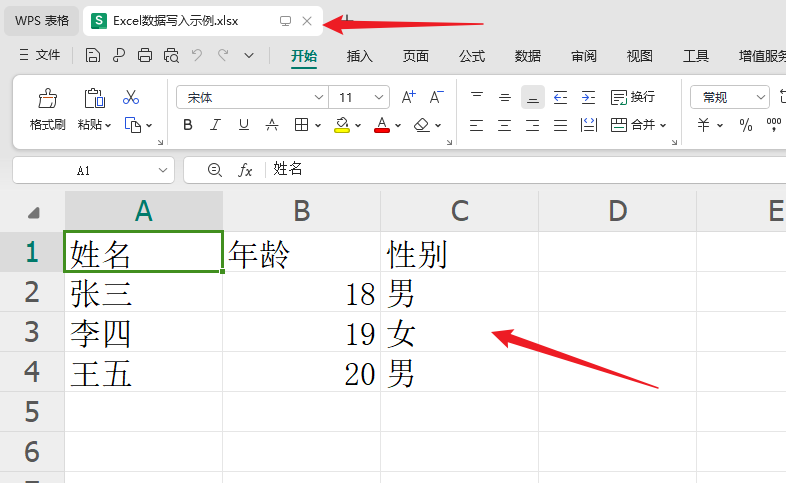
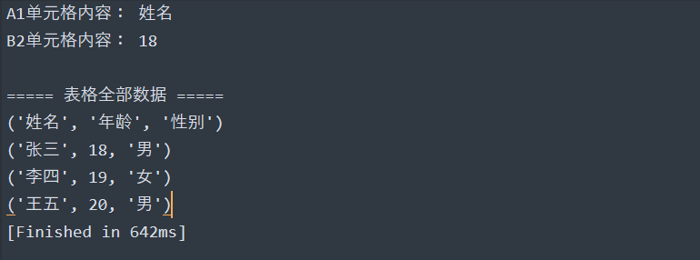
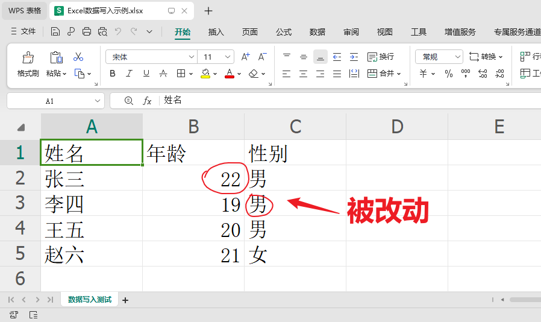
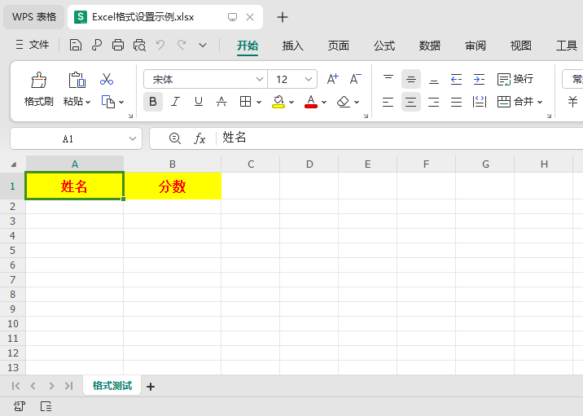
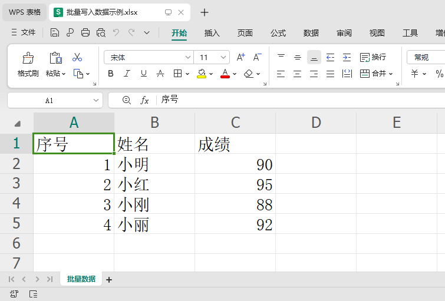

# openpyxl 小白零基础学习笔记（超详细\+通俗示例）

**前言**：openpyxl 是 Python 专门用来操作 Excel 文件的第三方库，**只支持 \.xlsx 格式**（2007及以上版本Excel），不支持老式 \.xls 格式。它可以实现 Excel 的创建、读写、修改、格式设置等所有常用功能，语法简单、新手友好。

**适用人群**：Python 小白、零基础入门Excel自动化

**学习目标**：掌握日常90%的Excel自动化操作

## 一、环境安装（第一步必做）

openpyxl 是第三方库，需要手动安装，打开电脑命令提示符（CMD）/终端，输入以下命令：

```python
pip install openpyxl
```

安装成功提示：无报错、显示 successfully installed 即可。

导入库（所有代码开头都需要导入）：

```python
# 核心导入语句，固定写法
from openpyxl import Workbook, load_workbook
```

## 二、核心基础概念（小白必懂）

Excel 文件结构层级（从上到下），搞懂这个就懂了一半！

1. **工作簿（Workbook）**：整个 Excel 文件（就是一个 \.xlsx 文件）

2. **工作表（Worksheet）**：Excel里的 Sheet1/Sheet2/Sheet3，一个工作簿可以有多个工作表

3. **单元格（Cell）**：表格里最小的格子，通过 行号\+列号 定位（如A1、B2）

对应关系：**Workbook\(文件\) → Worksheet\(工作表\) → Cell\(单元格\)**

## 三、实战核心操作（附带完整示例）

### 1、新建Excel文件 \+ 新建工作表

功能：创建一个空白的Excel文件，自定义工作表名称

```python
# 1. 导入库
from openpyxl import Workbook

# 2. 创建一个空白工作簿（新建Excel文件）
wb = Workbook()

# 3. 获取当前默认的工作表（默认自带Sheet）
ws = wb.active
# 给工作表重命名（可选，默认名字不好记）
ws.title = "学生信息表"

# 4. 保存文件（必须写！不写不会生成文件）
# 文件路径可以写绝对路径/相对路径，这里保存在当前文件夹
wb.save("我的第一个Excel.xlsx")

print("Excel文件创建成功！")
```

**小白注意**：save\(\) 是核心！所有修改必须保存才会生效！

### 2、给单元格写入数据（3种常用方法）

支持单个写入、批量写入，新手优先前两种

```python
from openpyxl import Workbook

wb = Workbook()
ws = wb.active
ws.title = "数据写入测试"

# 方法1：通过单元格坐标写入（最简单，适合少量数据）
ws["A1"] = "姓名"
ws["B1"] = "年龄"
ws["C1"] = "性别"

#运行结果：
#在第一行分别写入：姓名，年龄，性别


# 方法2：通过行号列号写入（数字形式，适合循环批量写入）
ws.cell(row=2, column=1, value="张三")
ws.cell(row=2, column=2, value=18)
ws.cell(row=2, column=3, value="男")

运行结果：
在第二行写入：张三，18，男

# 方法3：批量写入一行数据（快捷高效）
ws.append(["李四", 19, "女"])
ws.append(["王五", 20, "男"])

# 保存文件
wb.save("Excel数据写入示例.xlsx")
print("数据写入完成！")
```

运行结果：方法123




### 3、读取已有Excel文件数据

日常最常用：读取现成Excel的内容，支持单个读取、全部读取

```python
from openpyxl import load_workbook

# 1. 加载已存在的Excel文件（参数read_only=False 可读写，默认即可）
wb = load_workbook("Excel数据写入示例.xlsx")

# 2. 选择工作表（两种方式）
# 方式1：通过工作表名称选择
ws = wb["数据写入测试"]
# 方式2：获取当前激活的工作表
# ws = wb.active

# 3. 读取单个单元格数据
print("A1单元格内容：", ws["A1"].value)
print("B2单元格内容：", ws.cell(row=2, column=2).value)

# 4. 读取所有数据（逐行遍历，最常用）
print("\n===== 表格全部数据 =====")
for row in ws.iter_rows(values_only=True):
    print(row)

# 不用保存，仅读取数据无需save
wb.close()
```

**参数说明**：`values_only=True` 只获取单元格数值，简化输出结果

运行结果：



### 4、修改已有Excel数据

直接对已有单元格重新赋值，保存即可覆盖修改

```python
from openpyxl import load_workbook

# 加载文件
wb = load_workbook("Excel数据写入示例.xlsx")
ws = wb["数据写入测试"]

# 修改指定单元格数据
ws["B2"] = 22  # 把张三的年龄18改成22
ws["C3"] = "男" # 把李四的性别改成男

# 新增一行数据
ws.append(["赵六", 21, "女"])

# 保存修改（必须保存！覆盖原文件）
wb.save("Excel数据写入示例.xlsx")
print("数据修改完成！")
wb.close()
```

运行结果：



第五行是新增的

### 5、新建多个工作表、删除工作表

```python
from openpyxl import Workbook

wb = Workbook()

# 新建多个自定义工作表
ws1 = wb.create_sheet("成绩表")  # 在末尾新建
ws2 = wb.create_sheet("班级表", 0) # 在最前面新建

# 删除工作表
wb.remove(wb["Sheet"]) # 删除默认空白工作表

# 查看所有工作表名称
print("所有工作表：", wb.sheetnames)   # 所有工作表： ['班级表', '成绩表']

wb.save("多工作表示例.xlsx")
```

运行效果：


### 6、常用基础格式设置（小白够用）

简单设置字体大小、加粗、单元格颜色、居中对齐

```python
from openpyxl import Workbook
from openpyxl.styles import Font, Alignment, PatternFill

wb = Workbook()
ws = wb.active
ws.title = "格式测试"

# 写入表头
ws["A1"] = "姓名"
ws["B1"] = "分数"

# 1. 设置字体：加粗、字号12、红色
font_style = Font(size=12, bold=True, color="FF0000")
ws["A1"].font = font_style
ws["B1"].font = font_style

# 2. 设置单元格居中对齐
align_style = Alignment(horizontal="center", vertical="center")
ws["A1"].alignment = align_style
ws["B1"].alignment = align_style

# 3. 设置单元格背景色（黄色）
fill_style = PatternFill("solid", fgColor="FFFF00")
ws["A1"].fill = fill_style
ws["B1"].fill = fill_style

# 4. 设置单元格行高、列宽
ws.row_dimensions[1].height = 25  # 第1行高度
ws.column_dimensions["A"].width = 15 # A列宽度
ws.column_dimensions["B"].width = 15 # B列宽度

wb.save("Excel格式设置示例.xlsx")
print("格式设置完成！")
```




### 7、批量循环写入数据（实战高频）

工作中最常用：循环批量生成表格数据，无需手动逐行写

```python
from openpyxl import Workbook

wb = Workbook()
ws = wb.active
ws.title = "批量数据"

# 写入表头
ws.append(["序号", "姓名", "成绩"])

# 模拟批量数据
student_list = [
    (1, "小明", 90),
    (2, "小红", 95),
    (3, "小刚", 88),
    (4, "小丽", 92)
]

# 循环批量写入
for data in student_list:
    ws.append(data)

wb.save("批量写入数据示例.xlsx")
print("批量数据写入完成！")
```


运行结果：



## 四、小白必避的5个坑（重点！）

1. **格式问题**：只支持 `.xlsx`，`.xls` 旧文件必须另存为xlsx再操作

2. **忘记保存**：所有增删改操作，必须执行 `wb.save()` 才会生效

3. **文件占用报错**：操作Excel前，**必须关闭打开的Excel文件**，否则会报错权限不足

4. **坐标混淆**：行和列从**1开始计数**，不是0（和Python列表不一样！）

5. **重复创建文件**：相同路径save会**直接覆盖原文件**，重要文件记得备份

## 五、极简总结（快速查表）

|功能|核心代码|
|---|---|
|新建文件|wb = Workbook\(\)|
|打开文件|wb = load\_workbook\("文件名.xlsx")|
|写入数据|ws\["A1"] = "内容"  ws\.append\(列表\)|
|读取数据|ws\["A1"]\.value / 循环iter\_rows\(\)|
|保存文件|wb\.save\("文件名.xlsx")|
|关闭文件|wb\.close\(\)|

