# openpyxl实现Excel表格的处理

前言

本篇文章详细介绍了`openpyxl模块`的各种使用方法，实现 python 对 Excel 表格的数据处理，同时简单介绍了`CSV模块`的用法，讲解了 python 如何以 CSV 的格式写入和[读取数据](https://so.csdn.net/so/search?q=读取数据&spm=1001.2101.3001.7020)；全文超 2 万字，超详细！！！，通过各种案例带你轻松学会两种数据处理的方法。

1、Excel 表格介绍

---

- **工作簿（Workbook）**

> 定义：一个 Excel 文件就是一个工作簿，它可以包含多个工作表。

- **工作表（Worksheet）**

> 定义：工作簿中的每一个页面称为一个工作表，默认工作簿包含三个工作表（Sheet1、Sheet2、Sheet3），但用户可以根据需要增加或删除工作表。当前正在使用或查看的表，称做活动表

- **单元格（Cell）**

> 定义：工作表中的每一个小格子称为单元格，是 Excel 中最基本的存储单位。
> 引用：单元格通过其所在的列标（如 A、B、C…）和行号（如 1、2、3…）来引用，如 A1、B2 等。

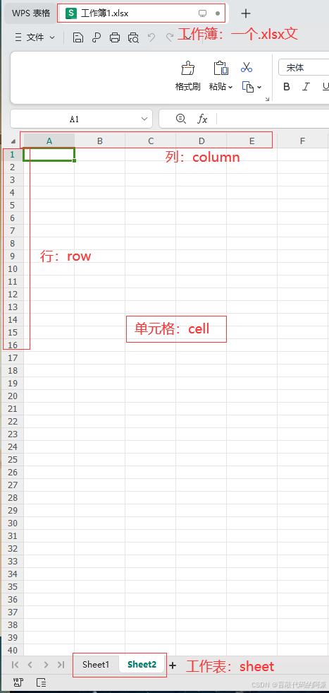

**xls和xlsx的说明**

> xls和xlsx是Excel表格的两种不同文件格式，它们在多个方面存在显著的差异。以下是它们之间的主要区别：
>
> 1. 版本
>    .xls：是 Excel 2003 及以前版本生成的文件格式。
>    .xlsx：是 Excel 2007 及以后版本生成的文件格式。
> 2. 文件结构
>    .xlsx 是基于 XML 文件结构存储数据
>    .xls 是基于二进制文件结构存储数据
> 3. 优缺点
>    由于xls 和xlsx 两者的文件结构不同，xlsx格式的文件在`功能和安全性`上都要优于xls；且xlsx格式可以向下兼容，打开xls 格式的文件
>
> Excel2007之后版本可以打开上述两种格式，但是Excel2003只能打开 xls 格式

2、openpyxl 模块

---

> 是 python 的第三方模块，用于处理 Excel 表格的数据，需要下载

### 2.1 模块的安装

> 命令：`pip install openpyxl`

### 2.2 基础操作

注意：后续所有操作案例中使用的 Excel 表格都是 test.xlsx，如下：

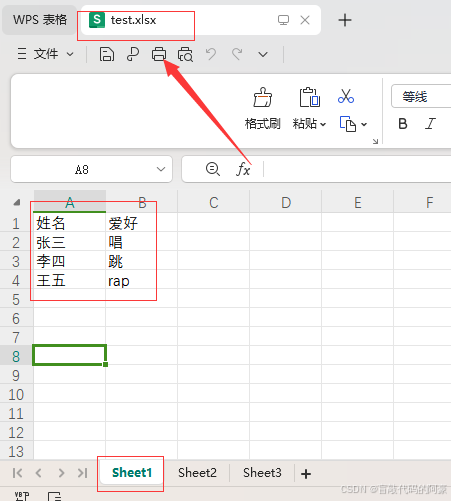

#### 2.2.1 生成 Excel 文件对象，查看所有 sheet 表

> 语法格式：`文件对象 = openpyxl.load_workbook('文件名')`
> 利用该方法打开一个 Excel 文件，并生成 workbook 对象，该对像用于操作打开的 Excel 文件

```python
# 导入模块
import openpyxl

# 1、打开文件，生成文件对象
workbook = openpyxl.load_workbook('test.xlsx') # 这里文件名，也可以是文件路径，如：D:day/test.xlsx
# 注意：该文件必须存在，不然会报错
# 2、打印test表格中所有的表，以列表形式返回
print(workbook.sheetnames) # 输出结果：['Sheet1', 'Sheet2', 'Sheet3']

```

#### 2.2.2 通过表名得到表对象

> 语法格式：`表对象 = 文件对象['表名']`
> 在 `2.2.1` 我们得到了 test.xlsx 文件中所有的表，每个表相当于一个表对象，接下来我们将获取指定的表对象，在后续操作中都是通过这个表对象来操作该表的

```python
# 导入模块
import openpyxl

# 1、打开文件，生成文件对象
workbook = openpyxl.load_workbook('test.xlsx') # 这里文件名，也可以是文件路径，如：D:day/test.xlsx
# 注意：该文件必须存在，不然会报错
# 2、打印test表格中所有的表
print(workbook.sheetnames) # ['Sheet1', 'Sheet2', 'Sheet3']
# 3、获取指定表，得到表对象sheet
sheet = workbook['Sheet1']
print(sheet) # 结果：<Worksheet "Sheet1"> ，代表一个表对象

```

#### 2.2.3 获取活动表对象

> 语法格式：`表对象 = 文件对象.active`
> 通过该方法得到活动表的表对象

```python
# 导入模块
import openpyxl

# 1、打开文件，生成文件对象
workbook = openpyxl.load_workbook('test.xlsx') # 这里文件名，也可以是文件路径，如：D:day/test.xlsx
# 注意：该文件必须存在，不然会报错
# 2、获取活动表，得到表对象sheet
sheet = workbook.active
print(sheet) # 结果：<Worksheet "Sheet3"> ，证明当前在使用或查看的表是 Sheet3

```

#### 2.2.4 获取表格中数据所占大小

> 语法格式：`表对象.dimensions`
> 该方法可以得到表格中数据占据了几行几列，如：5 行 5 列 就表示为 A1:E5

数据展示：


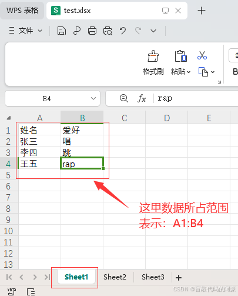

案例：

```python
# 导入模块
import openpyxl

# 1、打开文件，生成文件对象
workbook = openpyxl.load_workbook('test.xlsx') # 这里文件名，也可以是文件路径，如：D:day/test.xlsx
# 注意：该文件必须存在，不然会报错
# 2、获取指定表对象
sheet = workbook['Sheet1']
# 3、获取数据所占表格大小
res = sheet.dimensions
print(res) # 输出结果：A1:B4

```

#### 2.2.5 获取单元格中的数据

**方法 1：通过指定坐标，获得单元格对象，取得其中的数据**

> 语法格式：`单元格对象.value`
> 通过该方法得到该单元格内的数据

```python
# 导入模块
import openpyxl

# 1、打开文件，生成文件对象
workbook = openpyxl.load_workbook('test.xlsx') # 这里文件名，也可以是文件路径，如：D:day/test.xlsx
# 注意：该文件必须存在，不然会报错
# 2、获取活动表对象
sheet = workbook.active
# 3、通过坐标得到指定单元格对象
cell1 = sheet['A1']
cell2 = sheet['B3']
print(cell1,cell2) # <Cell 'Sheet1'.A1> <Cell 'Sheet1'.B3> ，代表A1和B3两个单元格对象

# 4、通过单元格对象得到单元格中的数据
res1 = cell1.value # 获得A1中的数据
res2 = cell2.value # 获得B3中的数据
print(res1,res2) # 输出结果：姓名 跳

```

**方法 2：通过指定行和列，获得单元格对象，取得其中数据**

> 语法格式：`单元格对象 = 表对象.cell(row=,column=)`
> 其中，row 表示行，column 表示列，通过该方法可以得到第几行第几列的单元格对象

```python
# 导入模块
import openpyxl

# 1、打开文件，生成文件对象
workbook = openpyxl.load_workbook('test.xlsx') # 这里文件名，也可以是文件路径，如：D:day/test.xlsx
# 注意：该文件必须存在，不然会报错
# 2、获取活动表对象
sheet = workbook.active
# 3、通过行和列得到指定单元格对象
cell1 = sheet.cell(row=1,column=1) # 表示获得第一行第一列的单元格对象
cell2 = sheet.cell(row=2,column=2) # 表示获得第2行第3列的单元格对象
print(cell1,cell2) # <Cell 'Sheet1'.A1> <Cell 'Sheet1'.C2> ，代表A1和C2两个单元格对象

# 4、通过单元格对象得到单元格中的数据
res1 = cell1.value # 获得A1中的数据
res2 = cell2.value # 获得C2中的数据
print(res1,res2) # 输出结果：姓名 唱

```

**注意：** 获取的单元格内没有数据，返回的结果为 `None`​

#### 2.2.6 获取表中单元格的行、列、坐标

> 语法格式：
> 1、`单元格对象.row` ：得到该单元格是第几行
> 2、`单元格对象.columns` ：得到该单元格是第几列
> 3、`单元格对象.coordinate`：得到该单元格的坐标

```python
# 导入模块
import openpyxl

# 1、打开文件，生成文件对象
workbook = openpyxl.load_workbook('test.xlsx') # 这里文件名，也可以是文件路径，如：D:day/test.xlsx
# 注意：该文件必须存在，不然会报错
# 2、获取活动表对象
sheet = workbook.active
# 3、得到指定单元格对象
cell1 = sheet.cell(row=3,column=2) # 表示获得第3行第2列的单元格对象
cell2 = sheet['C2'] # 表示得到B3位置的单元格对象

# 4、获得单元格的行、列、坐标
print(cell1.row, cell1.column, cell1.coordinate) # 输出结果：3 2 B3
print(cell2.row, cell2.column, cell2.coordinate) # 输出结果：2 3 C2

```

#### 2.2.7 获得指定区间范围内的数据

**1. 获取指定区间的数据**

> 语法格式：`表对象.['区间']`，如：sheet.[‘A1:A5’]
> 通过该方法可以得到区间范围内的所有单元格对象，以元组的形式返回，通过这些对象可以得到其单元格对应的数据

```python
# 导入模块
import openpyxl

# 1、打开文件，生成文件对象
workbook = openpyxl.load_workbook('test.xlsx') # 这里文件名，也可以是文件路径，如：D:day/test.xlsx
# 注意：该文件必须存在，不然会报错
# 2、获取活动表对象
sheet = workbook.active
print(f'当前活动表为：{sheet}')

# 3、得到指定区间内的所有单元格对象
cell = sheet['A1:A3'] # 得到 A1、A2、A3的单元格对象
print(f'所有单元格对象：{cell}') # 以元组形式返回
# 4、打印出所有单元格对象中的数据，这里直接使用for循环所有对象遍历出来
print('A1:A3的单元格数据依次为：')
for i in cell: # 这里嵌套了两个元组，需要两个for循环
    for x in i:
        print(x.value) # 得到单元格数据

```

输出结果：

```python
当前活动表为：<Worksheet "Sheet1">
所有单元格对象：((<Cell 'Sheet1'.A1>,), (<Cell 'Sheet1'.A2>,), (<Cell 'Sheet1'.A3>,))
A1:A3的单元格数据依次为：
姓名
张三
李四

```

**2. 获取指定行或列的数据**

> 语法格式：
> 1、`表对象.['A']`：表示获取第 A 列所有单元格对象
> 2、`表对象.['A:C']`：表示获取 A、B、C 三列所有单元格对象
> 3、`表对象.[2]`：表示获取第 2 行所有单元格对象
> 注意：只会获取到有数据的单元格对象

案例 1：获取某一行的单元格数据

```python
# 导入模块
import openpyxl

# 1、打开文件，生成文件对象
workbook = openpyxl.load_workbook('test.xlsx') # 这里文件名，也可以是文件路径，如：D:day/test.xlsx
# 注意：该文件必须存在，不然会报错
# 2、获取活动表对象
sheet = workbook.active
print(f'当前活动表为：{sheet}')

# 3、得到指定行中所有单元格对象
cell = sheet['2'] # 得到第2行中所有的单元格对象
print(f'所有单元格对象：{cell}') # 以元组形式返回
# 4、打印出所有单元格对象中的数据，这里直接使用for循环所有对象遍历出来
print('第2行所有单元格数据依次为：')
for i in cell: # 只有一个元组，只用一个for循环即可
    print(i.value) # 得到单元格数据

```

输出结果：

```python
当前活动表为：<Worksheet "Sheet1">
所有单元格对象：(<Cell 'Sheet1'.A2>, <Cell 'Sheet1'.B2>)
第2行所有单元格数据依次为：
张三
唱

```

案例 2：获取某两列的单元格数据

```python
# 导入模块
import openpyxl

# 1、打开文件，生成文件对象
workbook = openpyxl.load_workbook('test.xlsx') # 这里文件名，也可以是文件路径，如：D:day/test.xlsx
# 注意：该文件必须存在，不然会报错
# 2、获取活动表对象
sheet = workbook.active
print(f'当前活动表为：{sheet}')

# 3、得到指定列中所有单元格对象
cell = sheet['A:B'] # 得到第A、B两列中所有的单元格对象
print(f'所有单元格对象：{cell}') # 以元组形式返回
# 4、打印出所有单元格对象中的数据，这里直接使用for循环所有对象遍历出来
print('A列和B列所有单元格数据依次为：')
for i in cell: # 这里嵌套了两个元组，需要两个for循环
    for x in i:
        print(x.value) # 得到单元格数据

```

输出结果：

```python
当前活动表为：<Worksheet "Sheet1">
所有单元格对象：((<Cell 'Sheet1'.A1>, <Cell 'Sheet1'.A2>, <Cell 'Sheet1'.A3>, <Cell 'Sheet1'.A4>), (<Cell 'Sheet1'.B1>, <Cell 'Sheet1'.B2>, <Cell 'Sheet1'.B3>, <Cell 'Sheet1'.B4>))
A列和B列所有单元格数据依次为：
姓名
张三
李四
王五
爱好
唱
跳
rap

```

#### 2.2.8 按行或按列读取单元格数据（迭代器）

> 语法格式：
> 1、`表对象.iter_rows(min_row=,max_row,min_col=,max_col=)`，按找顺序一行一行的读取数据
> 2、`表对象.iter_cols(min_row=,max_row,min_col=,max_col=)`，按照顺序一列一列的读取数据
>
> 参数说明：
> min_row：表示从第几行开始读取
> max_row：表示读取到第几行借结束
> min_col：表示从第几列开始读取
> max_col：表示读取到第几列结束

数据演示：

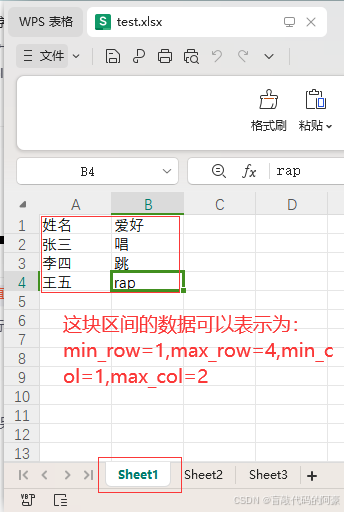

```python
# 导入模块
import openpyxl

# 1、打开文件，生成文件对象
workbook = openpyxl.load_workbook('test.xlsx') # 这里文件名，也可以是文件路径，如：D:day/test.xlsx
# 注意：该文件必须存在，不然会报错
# 2、获取活动表对象
sheet = workbook.active
print(f'当前活动表为：{sheet}')

# 3、按行的顺序读取数据
data1 = sheet.iter_rows(min_row=2,max_row=4,min_col=1,max_col=2) # data接收的是这块区间单元格对象
print(f'行区间单元格对象:{data1}')
# 将读取的数据通过for循环遍历出来,需要两个for循环
print('按行的顺序读取的数据：')
for i in data1:
    for x in i:
        print(x.value)

# 4、按列的顺序读取数据
data2 = sheet.iter_cols(min_row=2,max_row=4,min_col=1,max_col=2) # data接收的是这块区间单元格对象
print(f'列区间单元格对象:{data2}')
# 将读取的数据通过for循环遍历出来,需要两个for循环
print('按列的顺序读取的数据：')
for i in data2:
    for x in i:
        print(x.value)

```

输出结果：

```python
当前活动表为：<Worksheet "Sheet1">
行区间单元格对象:<generator object Worksheet._cells_by_row at 0x000001D8757D3DD0>
按行的顺序读取的数据：
张三
唱
李四
跳
王五
rap
列区间单元格对象:<generator object Worksheet._cells_by_col at 0x000001D8757D3F90>
按列的顺序读取的数据：
张三
李四
王五
唱
跳
rap

```

#### 2.2.9 获取表中数据所占的行列数

> 语法格式：
> 1、`表对象.max_row`，获取到表中数据有几行
> 2、`表对象.max_column`，获取到表中数据有几列

```python
# 导入模块
import openpyxl

# 1、打开文件，生成文件对象
workbook = openpyxl.load_workbook('test.xlsx') # 这里文件名，也可以是文件路径，如：D:day/test.xlsx
# 注意：该文件必须存在，不然会报错
# 2、获取活动表对象
sheet = workbook.active
print(f'当前活动表为：{sheet}')

# 3、得到表中数据所占行列数
row = sheet.max_row
col = sheet.max_column
print(f'表中有{row}行数据')
print(f'表中有{col}列数据')

# 4、扩展
# row = sheet.min_row 表示得到表中的最小行数，结果：1
# col = sheet.min_column 表示得到表中的最小列数，结果：1
# 不管表中是否有数据，这两种方法得到的结果都是 1，所以作用不大，大家了解即可

```

输出结果：

```
当前活动表为：<Worksheet "Sheet1">
表中有4行数据
表中有2列数据

```

#### 2.2.10 获取到表中所有行和列的数据

> 语法格式：
> 1、`表对象.rows`：获取表中所有行的对象
> 2、`表对象.columns`：获取表中所有列的对象
> 只会获取到有数据的行和列

```python
# 导入模块
import openpyxl

# 1、打开文件，生成文件对象
workbook = openpyxl.load_workbook('test.xlsx') # 这里文件名，也可以是文件路径，如：D:day/test.xlsx
# 注意：该文件必须存在，不然会报错
# 2、获取活动表对象
sheet = workbook.active
print(f'当前活动表为：{sheet}')

# 3、获取所有行中的数据
data1 = sheet.rows
print(f'所有行对象：{data1}')
# 通过for循环将每行的单元格对象遍历出来
for i in data1:
    print(i)
    for x in i:
        print(x.value) # 打印所有单元格数据

print('==============')
# 4、获取所有列中的数据
data2 = sheet.columns
print(f'所有列对象{data2}')
# 通过for循环将每行的单元格对象遍历出来
for i in data2:
    print(i)
    for x in i:
        print(x.value) # 打印所有单元格数据

```

输出结果：

```python
当前活动表为：<Worksheet "Sheet1">
所有行对象：<generator object Worksheet._cells_by_row at 0x000001E6F8263DD0>
(<Cell 'Sheet1'.A1>, <Cell 'Sheet1'.B1>)
姓名
爱好
(<Cell 'Sheet1'.A2>, <Cell 'Sheet1'.B2>)
张三
唱
(<Cell 'Sheet1'.A3>, <Cell 'Sheet1'.B3>)
李四
跳
(<Cell 'Sheet1'.A4>, <Cell 'Sheet1'.B4>)
王五
rap
==============
所有列对象<generator object Worksheet._cells_by_col at 0x000001E6F8263E40>
(<Cell 'Sheet1'.A1>, <Cell 'Sheet1'.A2>, <Cell 'Sheet1'.A3>, <Cell 'Sheet1'.A4>)
姓名
张三
李四
王五
(<Cell 'Sheet1'.B1>, <Cell 'Sheet1'.B2>, <Cell 'Sheet1'.B3>, <Cell 'Sheet1'.B4>)
爱好
唱
跳
rap

```

### 2.3 操作进阶

#### 2.3.1 创建新的 Excel 文件

```python
# 导入模块
import openpyxl

# 1、生成文件对象
workbook = openpyxl.Workbook()
# 2、生成一个表对象
sheet = workbook.active
# 3、创建指定名称的表，不写这一步，默认创建一个 Sheet表
sheet.title = 'sheet表1'
# 4、保存为指定excel文件
workbook.save('1.xlsx') # 这里的文件名也可以是文件路径，如：D:day/1.xlsx

```

执行效果：

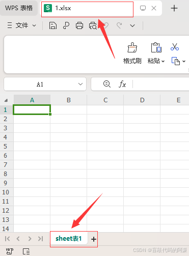

#### 2.3.2 修改单元格数据，Excel 表格另存为

```python
# 导入模块
import openpyxl

# 1、打开文件，生成文件对象
workbook = openpyxl.load_workbook('test.xlsx') # 这里文件名，也可以是文件路径，如：D:day/test.xlsx
# 注意：该文件必须存在，不然会报错
# 2、创建活动表对象
sheet = workbook.active
# 3、修改表中单元格数据
# 写法1：推荐
sheet['A1'] = 'name'
# 写法2：不推荐
sheet['B1'].value = 'hobby'
# 4、将文件另存为新的文件
workbook.save('2.xlsx') # 这里文件名使用原名，文件直接保存，若使用新的名称，文件会另存为新的文件

```

执行效果：

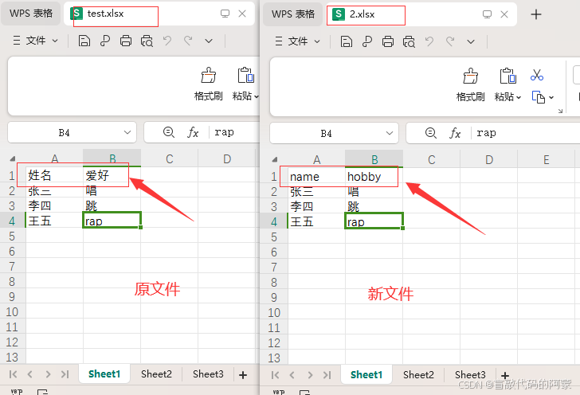

#### 2.3.3 向表中添加数据

> 语法格式：`表对象.append([数据1,数据2,...])`
> 该方法必须将数据放入到列表中，才能添加；数据会接着原有数据的下面按行插入

```python
# 导入模块
import openpyxl

# 1、打开文件，生成文件对象
workbook = openpyxl.load_workbook('test.xlsx') # 这里文件名，也可以是文件路径，如：D:day/test.xlsx
# 注意：该文件必须存在，不然会报错
# 2、创建活动表对象
sheet = workbook.active
# 3、像表中按行插入数据
sheet.append(['叶辰','篮球','啦啦啦'])
# 4、保存文件
workbook.save('test.xlsx') # 这里文件名使用原名，文件直接保存，若使用新的名称，文件会另存为新的文件

```

执行效果：

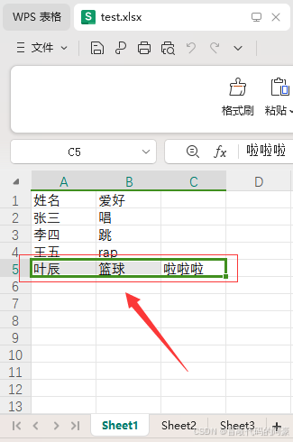

#### 2.3.4 向表中插入空白行和空白列

> 语法格式：
> 1、`表对象.insert_rows(idx=数字, amount=插入的行数)`
> 表示在 idx 指定的行数向下插入空白行
> 2、`表对象.insert_cols(idx=数字, amount=插入的列数)`
> 表示在 idx 指定的列数左侧插入空白列

```python
# 导入模块
import openpyxl

# 1、打开文件，生成文件对象
workbook = openpyxl.load_workbook('test.xlsx') # 这里文件名，也可以是文件路径，如：D:day/test.xlsx
# 注意：该文件必须存在，不然会报错
# 2、创建活动表对象
sheet = workbook.active
# 3、向表中插入空白行和空白列
sheet.insert_rows(idx=2,amount=2) # 表示在第2行向下插入2个空白行
sheet.insert_cols(idx=2,amount=1) #表示在第2列左侧插入1个空白列
# 4、保存文件
workbook.save('test.xlsx') # 这里文件名使用原名，文件直接保存，若使用新的名称，文件会另存为新的文件

```

执行效果：

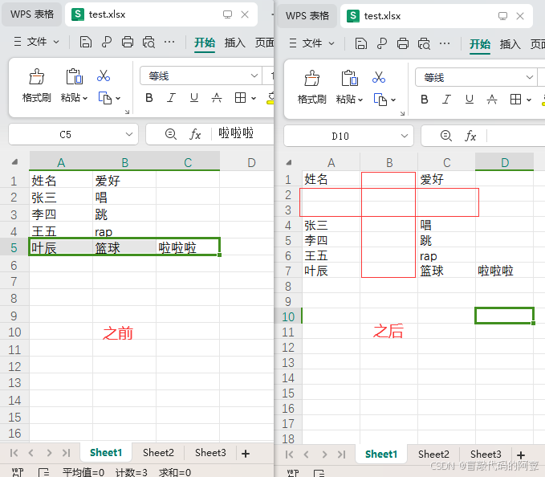

#### 2.3.5 删除表中的行和列

> 语法格式：
> 1、`delete_rows(idx=数字, amount=要删除的行数)`
> 表示 idx 指定的那一行开始 (包括自己)，删除 amount 指定的行数
> 2、`delete_cols(idx=数字, amount=要删除的列数)`
> 表示从 idx 指定的那一列开始 (包括自己)，往右删除 amount 指定的列数

```python
# 导入模块
import openpyxl

# 1、打开文件，生成文件对象
workbook = openpyxl.load_workbook('test.xlsx') # 这里文件名，也可以是文件路径，如：D:day/test.xlsx
# 注意：该文件必须存在，不然会报错
# 2、创建活动表对象
sheet = workbook.active
# 3、删除表中的行和列
sheet.delete_rows(idx=1) # 表示删除第1行
sheet.delete_cols(idx=1,amount=2) # 表示从第1列开始往右删除两列
# 4、保存文件
workbook.save('test.xlsx') # 这里文件名使用原名，文件直接保存，若使用新的名称，文件会另存为新的文件

```

执行效果：

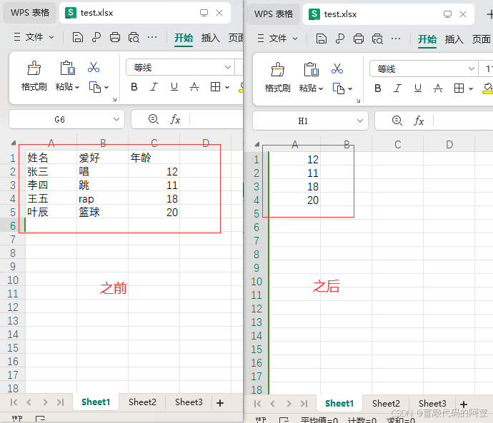

#### 2.3.6 字母列号与数字列号之间的转换（了解）

> 1、导入模块：`from openpyxl.utils import get_column_letter, column_index_from_string`
> 2、语法格式：
> `get_column_letter(数字)` ，根据列的的数字返回字母
> `column_index_from_string('字母')`，根据列的字母返回数字

案例：

```
# 导入模块
import openpyxl
from openpyxl.utils import get_column_letter, column_index_from_string

# 1、打开文件，生成文件对象
workbook = openpyxl.load_workbook('test.xlsx') # 这里文件名，也可以是文件路径，如：D:day/test.xlsx
# 注意：该文件必须存在，不然会报错
# 2、创建活动表对象
sheet = workbook.active
# 3、根据列的数字返回字母
print(get_column_letter(3)) # 结果：C ,这里相当于第3列，用字母表示就是C
# 4、更据字母返回列数
print(column_index_from_string('D')) # 结果：4 ，这里相当于D列，用数字表示就是第4列

```

#### 2.3.7 设置字体样式

**1. 查看字体样式**

```python
# 导入模块
import openpyxl

# 1、打开文件，生成文件对象
workbook = openpyxl.load_workbook('test.xlsx') # 这里文件名，也可以是文件路径，如：D:day/test.xlsx
# 注意：该文件必须存在，不然会报错
# 2、创建活动表对象
sheet = workbook.active
# 3、获取单元格对象
cell = sheet['A1'] # 得到A1单元格对象
# 4、获取字体样式对象
font = cell.font # 得到该单元格的字体样式对象
# 5、打印该单元格数据的字体样式
print('下面是该单元格数据的字体样式：')
print(font.name) # 字体名称
print(font.size) # 字体大小
print(font.bold) # 字体是否粗体，返回结果为bool值
print(font.italic) # 字体是否为斜体，返回结果为bool值
print(font.color) # 字体颜色

```

输出结果：

```python
下面是该单元格数据的字体样式：
等线
11.0
False
False
<openpyxl.styles.colors.Color object>
Parameters:
rgb=None, indexed=None, auto=None, theme=1, tint=0.0, type='theme'

```

**2. 修改字体样式**

> 1、导入模块：`import openpyxl.styles`
> 2、语法格式：`字体样式对象 = openpyxl.styles.Font(name=字体名称,size=字体大小,bold=是否加粗,italic=是否斜体,color=字体颜色)`
> 注意：这里的字体颜色需要使用 RGB 的 16 进制表示，大家可自行在网上查找

案例 1：修改一个单元格字体样式

```python
# 导入模块
import openpyxl
import openpyxl.styles

# 1、打开文件，生成文件对象
workbook = openpyxl.load_workbook('test.xlsx') # 这里文件名，也可以是文件路径，如：D:day/test.xlsx
# 注意：该文件必须存在，不然会报错
# 2、创建活动表对象
sheet = workbook.active
# 3、获取单元格对象
cell = sheet['A1'] # 得到A1单元格对象
# 4、修改字体样式
cell.font = openpyxl.styles.Font(name='微软雅黑',size='20',bold=True,italic=True,color='FF0000')
# 5、保存文件
workbook.save('test.xlsx')

```

执行效果：

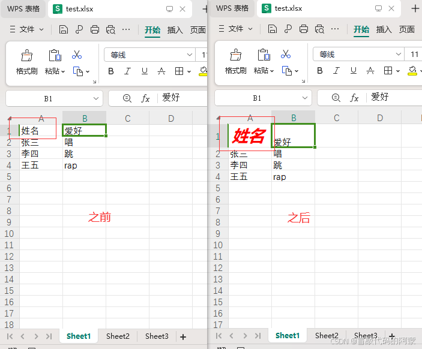

案例 2：修改多个单元格字体样式

```python
# 导入模块
import openpyxl
import openpyxl.styles

# 1、打开文件，生成文件对象
workbook = openpyxl.load_workbook('test.xlsx') # 这里文件名，也可以是文件路径，如：D:day/test.xlsx
# 注意：该文件必须存在，不然会报错
# 2、创建活动表对象
sheet = workbook.active
# 3、获取单元格对象
cell = sheet['A'] # 这里获取了A列所有数据的单元格对象
# 4、使用for循环，修改A列每个单元格的字体样式
for i in cell:
    i.font = openpyxl.styles.Font()
# 5、保存文件
workbook.save('test.xlsx')

```

执行效果：

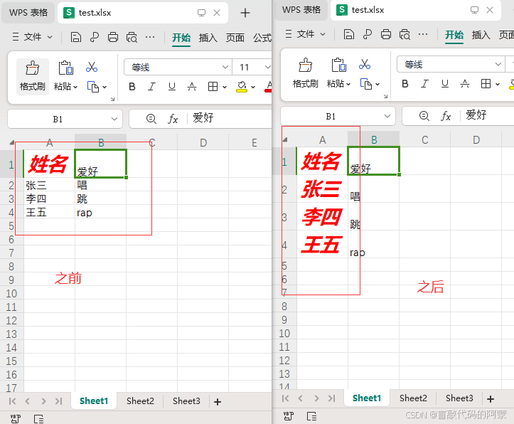

#### 2.3.8 设置对齐格式

> 语法格式： `openpyxl.styles.Alignment(horizontal=水平对齐模式,vertical=垂直对齐模式,text_rotation=旋转角度,wrap_text=是否自动换行)`
> 参数说明：
> 1、水平对齐模式：`‘distributed’，‘justify’，‘center’，‘left’， ‘centerContinuous’，'right，‘general’`
> 2、垂直对齐模式：`‘bottom’，‘distributed’，‘justify’，‘center’，‘top’`
> 3、旋转角度：用数字表示，如：90
> 4、是否自动换行：True 或 False

案例 1：修改一个单元格对齐格式

```python
# 导入模块
import openpyxl
import openpyxl.styles

# 1、打开文件，生成文件对象
workbook = openpyxl.load_workbook('test.xlsx') # 这里文件名，也可以是文件路径，如：D:day/test.xlsx
# 注意：该文件必须存在，不然会报错
# 2、创建活动表对象
sheet = workbook.active
# 3、获取单元格对象
cell = sheet['A1'] # 这里获取了A1的单元格对象
# 4、修改对齐格式
cell.alignment = openpyxl.styles.Alignment(horizontal="center", vertical="center", text_rotation=0, wrap_text=True)
# 5、保存文件
workbook.save('test.xlsx')

```

执行效果：

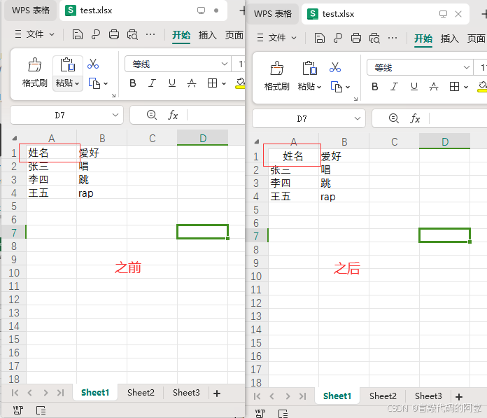

案例 2：修改多个单元格对齐格式

```python
# 导入模块
import openpyxl
import openpyxl.styles

# 1、打开文件，生成文件对象
workbook = openpyxl.load_workbook('test.xlsx') # 这里文件名，也可以是文件路径，如：D:day/test.xlsx
# 注意：该文件必须存在，不然会报错
# 2、创建活动表对象
sheet = workbook.active
# 3、获取单元格对象
cell = sheet['A'] # 这里获取了A列所有的单元格对象
# 4、通过for循环修改A列所有单元格对齐格式
for i in cell:
    i.alignment = openpyxl.styles.Alignment(horizontal="center", vertical="center", text_rotation=0, wrap_text=True)
# 5、保存文件
workbook.save('test.xlsx')
```

执行效果：

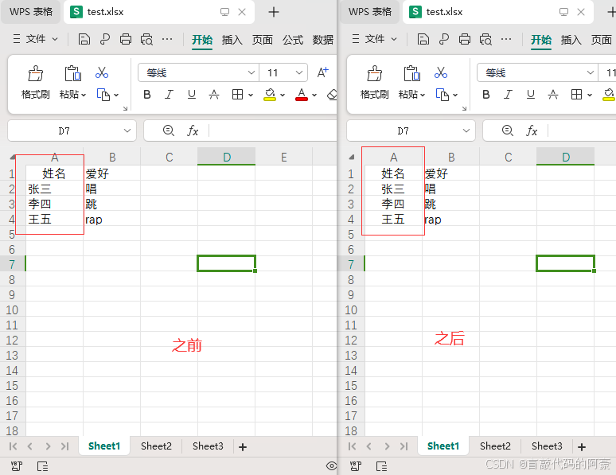

#### 2.3.9 设置行高、列宽

> 语法格式：
> 1、`表对象.row_dimensions[行数].height = 行高`
> 2、`表对象.column_dimensions['列数'].width = 列宽`
> 参数说明：
> 行数、列数：表示要设置第几行或第几列
> 行高、列宽：用数字表示，如：30

```python
# 导入模块
import openpyxl

# 1、打开文件，生成文件对象
workbook = openpyxl.load_workbook('test.xlsx') # 这里文件名，也可以是文件路径，如：D:day/test.xlsx
# 注意：该文件必须存在，不然会报错
# 2、创建活动表对象
sheet = workbook.active
# 3、设置第1行的高度为60磅
sheet.row_dimensions[1].height = 60 # 默认单位 磅
# 4、设置第B列的宽度为30字符
sheet.column_dimensions['B'].width = 30 # 默认单位 字符
# 5、保存文件
workbook.save('test.xlsx')
```

执行效果：

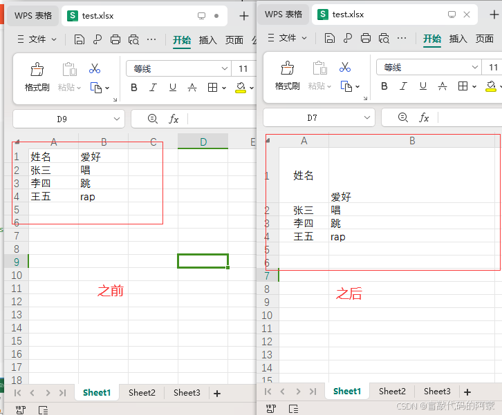

#### 2.3.10 合并、拆分单元格

**1. 合并单元格**

> 语法格式：
> 方法 1、`表对象.merge_cells('要合并的单元格坐标')`
> 单元格坐标用 `:` 连接，如：A1:B1
> 方法 2、`表对象.merge_cells(start_row=起始行号，end_row=结束行号，start_column=起始列号，end_column=结束列号)`
> 注意：
> 合并单元格时，不能将两个有数据的单元格合并，不然可能会报错

```python
# 导入模块
import openpyxl

# 1、打开文件，生成文件对象
workbook = openpyxl.load_workbook('test.xlsx') # 这里文件名，也可以是文件路径，如：D:day/test.xlsx
# 注意：该文件必须存在，不然会报错
# 2、创建活动表对象
sheet = workbook.active
# 3、合并单元格
# 方法1：
sheet.merge_cells('B1:C1') # 合并B1和C1两个单元格
# 方法2：
sheet.merge_cells(start_row=4,end_row=5,start_column=1,end_column=2)
# 5、保存文件
workbook.save('test.xlsx')


```

执行效果：

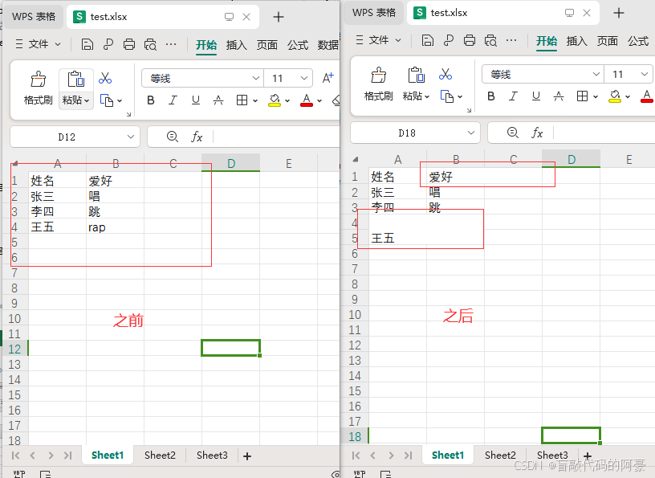

**2. 拆分单元格**

> 语法格式：
> 方法 1、`表对象.unmerge_cells('要合并的单元格坐标')`
> 单元格坐标用 `:` 连接，如：A1:B1
> 方法 2、`表对象.unmerge_cells(start_row=起始行号，end_row=结束行号，start_column=起始列号，end_column=结束列号)`

*拆分单元格的用法与合并单元格的用法一致，这里不在细讲*

#### 2.3.11 设置单元格边框样式（颜色和线条）

> 语法格式：`单元格对象.border = border对象`
> 这里我们主要需要设置的参数就是 border 对象，下面我会通过案例和文字进行详细说明

案例：

```python
# -*- coding: utf-8 -*-
"""
Author: @CSDN盲敲代码的阿豪
Time: 2025/1/27 21:16
Project: openpyxl模块的使用
BLog homepage: https://blog.csdn.net/m0_59470317?spm=1011.2124.3001.5343
"""

# 导入模块
from openpyxl import Workbook
from openpyxl.styles import Border, Side

# 1、创建一个新的工作簿
wb = Workbook()
# 2、激活工作表
ws = wb.active

# 3、创建一个 border 对象，设置单元格上、下、左、右 各边框的样式
border = Border(
    left=Side(style="thin", color="FF0000"),  # 左边框，红色细线
    right=Side(style="medium", color="00FF00"),  # 右边框，绿色中线
    top=Side(style="dashed", color="0000FF"),  # 上边框，蓝色虚线
    bottom=Side(style="dotted", color="FFFF00"),  # 下边框，黄色点线
)

# 4、将边框应用到目标单元格
ws['B3'].border = border
# 5、写入一些数据到单元格，以便查看效果
ws['B3'] = "阿豪"

# 6、保存工作簿
wb.save("cell_style.xlsx")

```

运行效果：

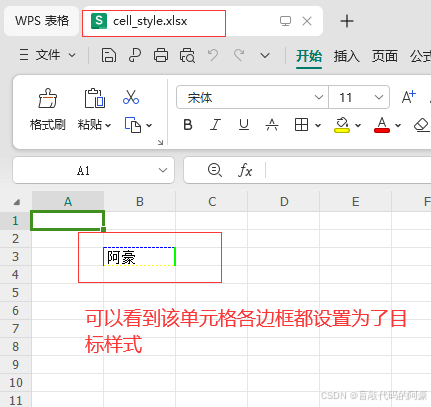

**参数说明：** 
从上面案例中我们可以看到`border 对象`，实际是一个 Border 类，其中参数的用法如下：

**1、Border 类**
`left`: 左边框，类型为 Side。
`right`: 右边框，类型为 Side。
`top`: 上边框，类型为 Side。
`bottom`: 下边框，类型为 Side。

**2、Side 类**

- style: 边框线条的样式，可选值包括：
  `thin`: 细线
  `thick`: 粗线
  `dashed`: 虚线
  `dotted`: 点线
  `double`: 双线
  `hair`: 极细线
  `mediumDashed`: 中等粗细的虚线
  `dashDot`: 点划线
  `mediumDashDot`: 中等粗细的点划线
  `dashDotDot`: 双点划线
  `mediumDashDotDot`: 中等粗细的双点划线
  `slantDashDot`: 斜点划线
- color: 边框的颜色，可以是 RGB 颜色值（如’FF0000’表示红色）或颜色名称（如’red’）。

#### 2.3.12 sheet 表的创建、修改、复制、删除

**1. 创建新的 sheet 表格**

> 语法格式：`文件对象.create_sheet(“表名”)`

```python
# 导入模块
import openpyxl

# 1、打开文件，生成文件对象
workbook = openpyxl.load_workbook('test.xlsx') # 这里文件名，也可以是文件路径，如：D:day/test.xlsx
# 注意：该文件必须存在，不然会报错
# 2、为test.xlsx文件创建新的sheet表
workbook.create_sheet('666')
# 3、查看所有的sheet表
print(workbook.sheetnames) # 输出结果：['Sheet1', 'Sheet2', 'Sheet3', '666']
# 4、保存文件
workbook.save('test.xlsx')

```

执行效果：

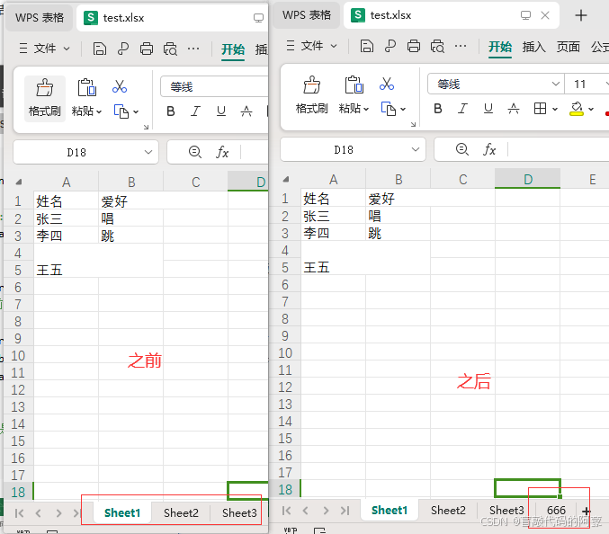

**2. 修改 sheet 表的名称**

> 语法格式：`表对象.title = '新表名'`

```python
# 导入模块
import openpyxl

# 1、打开文件，生成文件对象
workbook = openpyxl.load_workbook('test.xlsx') # 这里文件名，也可以是文件路径，如：D:day/test.xlsx
# 注意：该文件必须存在，不然会报错
# 2、获取要修改名称的sheet表对象
sheet = workbook['666']
# 3、修改表的名称为‘阿豪666’
sheet.title = '阿豪666'
# 4、查看所有sheet表
print(workbook.sheetnames) # 输出结果：['Sheet1', 'Sheet2', 'Sheet3', '阿豪666']
# 5、保存文件
workbook.save('test.xlsx')

```

执行效果：

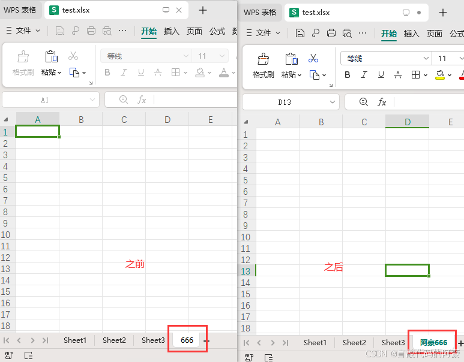

**3. 复制 sheet 表**

> 语法格式：`文件对象.copy_worksheet('表名')`

```python
# 导入模块
import openpyxl

# 1、打开文件，生成文件对象
workbook = openpyxl.load_workbook('test.xlsx') # 这里文件名，也可以是文件路径，如：D:day/test.xlsx
# 注意：该文件必须存在，不然会报错
# 2、获取想要复制的sheet表对象
sheet = workbook['阿豪666']
# 3、复制sheet表
workbook.copy_worksheet(sheet)
# 5、保存文件
workbook.save('1.xlsx')
# 注意：这里文件名使用原名，复制的sheet表就保存到该文件下；
# 若使用新的文件名，那么复制的sheet表就会另存为新的文件中

```

执行效果：

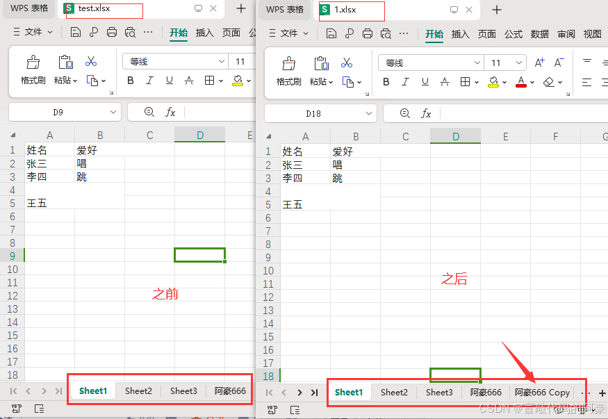

**4. 删除 sheet 表**

> 语法格式：`remove('sheet名')`
> 注意：因为该方法只能删除活动表，所以要删除某个 sheet 表，必须先把该表转换为活动表

```python
# 导入模块
import openpyxl

# 1、打开文件，生成文件对象
workbook = openpyxl.load_workbook('test.xlsx') # 这里文件名，也可以是文件路径，如：D:day/test.xlsx
# 注意：该文件必须存在，不然会报错
# 2、激活活动表，获取活动表对象
sheet  = workbook.active
print(f'当前活动表为：{sheet}')
# 3、选择要删除的sheet表，将其转换为活动表
sheet = workbook['阿豪666'] # 前面我们激活了活动表，这里重新选择新的表，那么该表会自动切换为活动表
print(f'现在的活动表为{sheet}')
# 4、删除当前活动表
workbook.remove(sheet)
print(workbook.sheetnames) # 查看当前所有表名
# 5、保存文件
workbook.save('test.xlsx')

```

输出结果：

```python
当前活动表为：<Worksheet "Sheet1">
现在的活动表为<Worksheet "阿豪666">
['Sheet1', 'Sheet2', 'Sheet3']

```

执行效果：

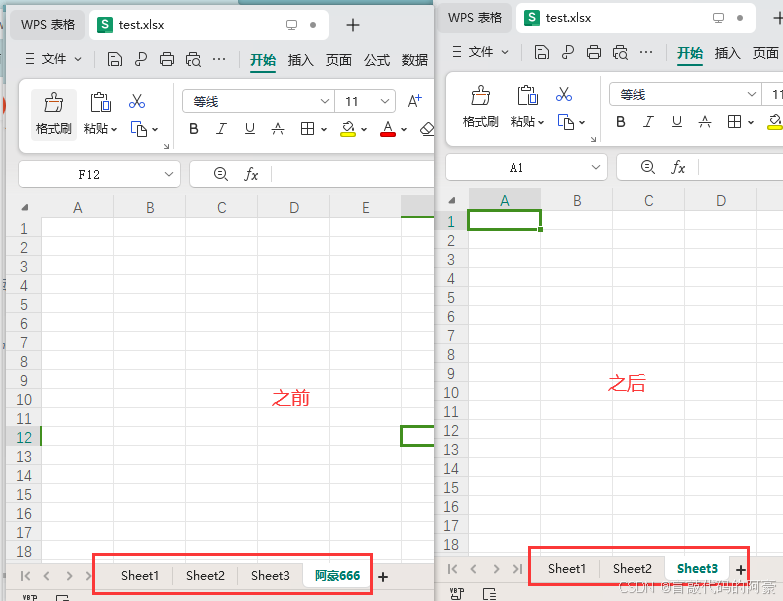

### 2.4 拓展：如何加快 [openpyxl 模块](https://so.csdn.net/so/search?q=openpyxl模块&spm=1001.2101.3001.7020)存取数据的速度？

> 在使用 openpyxl 模块处理 Excel 表格时，如果数据量较大，可能会遇到存取速度慢的问题。为了提高数据存取速度，可以采取一些优化措施。

#### 2.4.1 加快数据写入速度（write_only 模式）

> 在写入大量数据时，使用 `write_only=True` 模式可以显著提高写入速度，因为它不会在内存中维护整个工作表的数据结构。

案例：

```python
# 导入模块
import openpyxl

# 创建excel对象
wb = openpyxl.Workbook(write_only=True) # 设置write_only=True模式，忽略数据结构
# 创建sheet表，生成表对象
ws = wb.create_sheet()

# 创建一个生成器来生成数据
data = (
    ('唱', '跳', 'rap'),
    (6, 66, 666),
    ('哈', '哈哈', '哈哈哈'),
    # 更多数据...
)

# 将数据依次遍历存入excel表格中
for row in data:
    ws.append(row)

# 保存表格
wb.save('write_data.xlsx')

```

#### 2.4.2 加快数据读取速度（read_only 模式和迭代器的使用）

> 读取大数据量的 Excel 文件时，设置`read_only`模式忽略数据结构，并使用 `iter_rows() 或 iter_cols()` 迭代器，可以逐行或逐列读取数据，减少内存使用并提高效率。

案例：

```
# 打开模块
import openpyxl

# 打开excel表，生成excel对象
wb = openpyxl.load_workbook('write_data.xlsx', read_only=True) # 设置read_only=True模式
# 生成活动表对象
ws = wb.active

# 使用迭代器按行读取数据
for row in ws.iter_rows(min_row=1, max_row=3, min_col=1, max_col=3):
    for cell in row:
        print(cell.value)

```

#### 2.4.3 禁用公式计算

> 如果你的 Excel 文件包含公式，并且你在读取数据时不需要计算公式，可以禁用公式计算以提高读取速度。
> 语法格式：`data_only=True`

```
wb = load_workbook('write_data.xlsx', read_only=True, data_only=True) # 设置data_only=True，禁用公式计算

```

#### 2.4.4 关闭不必要的样式和格式

> 如果你不需要保留 Excel 文件中的样式和格式，可以在读取时关闭它们，以提高性能。
> 语法格式：`keep_vba=False`

```python
wb = load_workbook('write_data.xlsx', read_only=True, keep_vba=False) # 设置keep_vba=False，关闭格式和样式
```

#### 2.4.5 其它方法

**1、使用 pandas 库进行数据处理**

> 对于大数据量的处理，pandas 库通常比 openpyxl 更高效。你可以先用 pandas 处理数据，再用 openpyxl 进行格式设置。

**2、使用多进程处理数据**

> 如果数据处理任务可以并行化，可以考虑使用多进程来加快处理速度。注意，Python 的多线程由于全局解释器锁（GIL）可能无法充分利用多核性能，但多进程可以绕过这一限制。

**3、升级 openpyxl 版本**

> 确保你使用的是最新版本的 openpyxl，新版本可能包含性能优化和 bug 修复。
> 命令：`pip install --upgrade openpyxl`

3、扩展：python 之 csv 模块——以 csv 格式保存数据

---

### 3.1 介绍

> csv 模块是 Python 的内置模块，用于读写 CSV（逗号分隔值）文件。CSV 文件是一种简单的文件格式，用于存储表格数据，包括数字和文本。尽管名字中包含 “逗号分隔值”，但 CSV 文件也可以使用其他分隔符，如制表符或分号，这取决于文件的具体格式。

### 3.2 导入模块

> 语法格式：`import csv`
> csv 模块是 python 内置模块，可以直接导入

### 3.3 基本使用

#### 3.3.1 写入 CSV 文件

> 使用 `csv.writer` 类可以创建一个写入器对象，该对象提供了一系列写入 CSV 文件的方法。

```python
# 导入模块
import csv

# 1、假设我们想要写入以下数据 ，数据必须构建成列表的形式才能写入
rows = [
    ["姓名", "年龄", "城市"],
    ["张三", 28, "北京"],
    ["李四", 34, "上海"],
    ["王五", 29, "广州"]
]

# 打开文件以写入数据，如果文件不存在则创建
with open('test.csv', 'w', encoding='utf-8',newline='') as csvfile: # 注意：这里 newline='' 表示某字符结尾写入，不写的话默认会空一行写入数据
    # 创建一个写入器对象
    writer = csv.writer(csvfile)

    # 遍历 rows 列表，csv会将每个列表中的数据一行行的写入文件
    for row in rows:
        writer.writerow(row)

```

执行效果：

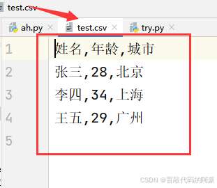

#### 3.3.2 读取 CSV 文件

> 使用 `csv.reader` 类可以创建一个读取器对象，用于读取 CSV 文件中的数据。

```python
# 导入模块
import csv

# 打开 CSV 文件进行读取  
with open('test.csv','r',encoding='utf-8') as csvfile:
    # 创建一个读取器对象  
    reader = csv.reader(csvfile)

    # 遍历 CSV 文件中的每一行数据，每行数据单独存放在一个列表中返回
    for row in reader:
        print(row)

```

输出结果：

```
['姓名', '年龄', '城市']
['张三', '28', '北京']
['李四', '34', '上海']
['王五', '29', '广州']

```

#### 3.2.3 使用 DictReader 和 DictWriter

> 对于更复杂的场景，当 CSV 文件的列名很重要时，可以使用 `csv.DictReader 和 csv.DictWriter` 类。这些类允许你将 CSV 文件中的行作为字典来处理，其中列名作为键。

**1. 写入数据**

```python
# 导入模块
import csv

# 文件的表头，也就是CSV文件中的第一行内容，列表中每个数据相当于下面字典数据中的键
fieldnames = ['姓名', '年龄', '城市']
# 将列表中的数据以字典的形式写入CSV文件
rows = [
    {'姓名': '张三', '年龄': 28, '城市': '北京'},
    {'姓名': '李四', '年龄': 34, '城市': '上海'},
]

with open('test.csv', 'w',newline='',encoding='utf-8') as csvfile: # 注意：这里 newline='' 表示某字符结尾写入，不写的话默认会空一行写入数据
    # 创建一个写入器对象,fieldnames= 用于接收上面写的表头，不写的话，插入字典数据会报错
    writer = csv.DictWriter(csvfile, fieldnames=fieldnames)

    # 先写入表头
    writer.writeheader()

    # 遍历 rows 列表，将字典一行行的写入 CSV 文件
    for row in rows:
        writer.writerow(row)

```

执行效果：

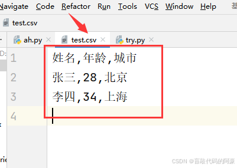

**2. 读取数据**

```python
# 导入模块
import csv

# 以读的方式打开CSV文件
with open('test.csv', 'r',encoding='utf-8') as csvfile:
    # 创建一个读取器对象
    reader = csv.DictReader(csvfile)

    # 遍历 CSV 文件中的每一行数据，以字典的形式返回
    for row in reader:
        print(row)

```

输出结果：

```
{'姓名': '张三', '年龄': '28', '城市': '北京'}
{'姓名': '李四', '年龄': '34', '城市': '上海'}
```
