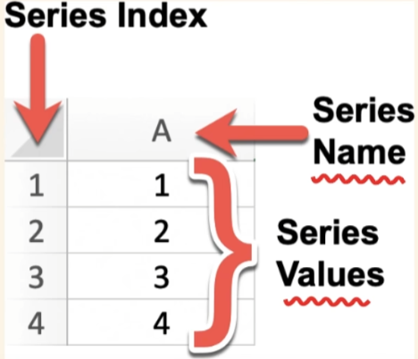
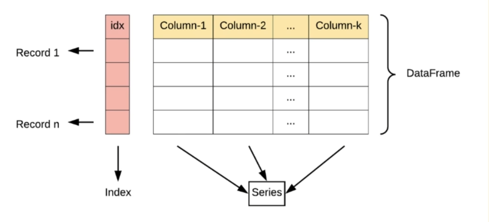

# Pandas 完整学习笔记（合并去重+完整实例+运行结果）
## 一、Pandas 基础介绍
### 1. 库定位
Pandas（Python Data Analysis Library）是基于 NumPy 的 Python 第三方数据分析库，专门用于**结构化表格数据预处理与分析**，内置大量高效处理大型数据集的工具、函数，是 Python 数据分析生态核心组件。

### 2. 三大核心数据结构
1. **Series**：一维带标签数组
2. **DataFrame**：二维表格（最常用，等价 Excel/数据表）
3. **Panel**：三维面板数据，现已极少使用，三维需求统一用 MultiIndex 多级索引替代

前置导入代码（所有示例统一开头）
```python
import pandas as pd
import numpy as np
```

---

# 二、Series 一维数据结构
## 2.1 核心定义与特点



Series 是 Pandas 最基础一维结构，可理解为**带自定义标签索引的数组/特殊字典**，DataFrame 由多个 Series 拼接而成。
- 一维结构，单列存储数据；由 `index`（索引）、`values`（数据）两部分组成
- 支持混合数据类型，混合时整体 `dtype=object`
- 创建后长度固定不可修改，但内部元素可修改
- 索引与数据自动对齐，是 Pandas 核心特性

## 2.2 多种创建方式（附代码+运行结果）
### 示例1：列表创建，默认数字索引
```python
s1 = pd.Series([1, 3, 5, 7, 9])
print(s1)
print("索引：", s1.index)
print("数据值：", s1.values)
```
运行结果：
```
0    1
1    3
2    5
3    7
4    9
dtype: int64
索引： RangeIndex(start=0, stop=5, step=1)
数据值： [1 3 5 7 9]
```

### 示例2：自定义标签索引创建
```python
s2 = pd.Series([1, 2, 3], index=['x', 'y', 'z'])
print(s2)
```
运行结果：
```
x    1
y    2
z    3
dtype: int64
```

### 示例3：字典创建（key自动作为索引）
```python
data_dict = {'a': 1, 'b': 2, 'c': 3}
s3 = pd.Series(data_dict)
print(s3)
```
运行结果：
```
a    1
b    2
c    3
dtype: int64
```

### 示例4：标量统一值创建
```python
s4 = pd.Series(5, index=['a', 'b', 'c'])
print(s4)
```
运行结果：
```
a    5
b    5
c    5
dtype: int64
```

### 示例5：混合数据类型（object类型）
```python
s5 = pd.Series([1,'a',5.2,7],index=['d','b','c','a'])
print(s5)
print("数据类型：", s5.dtype)
```
运行结果：
```
d      1
b      a
c    5.2
a      7
dtype: object
数据类型： object
```

### 示例6：NumPy数组创建、指定数据类型
```python
arr = np.array([1.1, 2.2, 3.3])
s6 = pd.Series(arr, dtype="float64")
print(s6)
```
运行结果：
```
0    1.1
1    2.2
2    3.3
dtype: float64
```

### 示例7：给Series命名
```python
s7 = pd.Series([10,20,30], name="语文成绩")
s7.index.name = "学生编号"
print(s7)
```
运行结果：
```
学生编号
0    10
1    20
2    30
Name: 语文成绩, dtype: int64
```

## 2.3 Series 核心属性查看
```python
s = pd.Series([10,20,30,40], index=["A","B","C","D"])
print("values：", s.values)
print("index：", s.index)
print("dtype：", s.dtype)
print("shape：", s.shape)
print("size：", s.size)
print("是否为空：", s.empty)
```
运行结果：
```
values： [10 20 30 40]
index： Index(['A', 'B', 'C', 'D'], dtype='object')
dtype： int64
shape： (4,)
size： 4
是否为空： False
```

## 2.4 数据取值访问（loc / iloc）
### 1）loc 标签索引（按自定义标签）
```python
s = pd.Series([1,'a',5.2,7],index=['d','b','c','a'])
# 单个标签取值
print(s['a'])
# 多个标签取值
print(s[['b','a']])
# 标签切片（包含首尾）
print(s['d':'c'])
```
运行结果：
```
7
b    a
a    7
dtype: object
d      1
b      a
c    5.2
dtype: object
```

### 2）iloc 位置索引（数字下标，左闭右开）
```python
s = pd.Series([10,20,30,40], index=["A","B","C","D"])
print("第1个元素：", s.iloc[0])
print("切片0~2：\n", s.iloc[0:2])
print("不连续取值：\n", s.iloc[[0,2]])
```
运行结果：
```
第1个元素： 10
切片0~2：
 A    10
B    20
dtype: int64
不连续取值：
 A    10
C    30
dtype: int64
```

### loc vs iloc 对比表
| 特性 | loc | iloc |
| ---- | ---- | ---- |
| 索引类型 | 自定义标签索引 | 原生数字位置索引 |
| 切片规则 | 包含结束值 | 不包含结束值 |
| 负数索引 | 不支持 | 支持 |
| 报错场景 | 标签不存在→KeyError | 下标越界→索引报错 |

## 2.5 Series 常用操作实战
### 示例1：条件筛选
```python
s = pd.Series([10,20,30,40])
print("大于20的值：\n", s[s > 20])
print("10~30之间的值：\n", s[(s>=10) & (s<=30)])
```
运行结果：
```
大于20的值：
 2    30
3    40
dtype: int64
10~30之间的值：
 0    10
1    20
2    30
dtype: int64
```

### 示例2：向量化运算、统计函数
```python
s = pd.Series([10,20,30,40])
print("全部+5：\n", s + 5)
print("平方：\n", s ** 2)
print("总和：", s.sum())
print("平均值：", s.mean())
print("降序排序：\n", s.sort_values(ascending=False))
```
运行结果：
```
全部+5：
 0    15
1    25
2    35
3    45
dtype: int64
平方：
 0     100
1     400
2     900
3    1600
dtype: int64
总和： 100
平均值： 25.0
降序排序：
 3    40
2    30
1    20
0    10
dtype: int64
```

### 示例3：缺失值处理（NaN）
```python
s = pd.Series([10, np.nan, 30, np.nan, 50])
print("缺失值布尔判断：\n", s.isnull())
print("缺失值数量：", s.isnull().sum())
print("删除缺失值：\n", s.dropna())
print("0填充缺失值：\n", s.fillna(0))
print("均值填充缺失值：\n", s.fillna(s.mean()))
```
运行结果：
```
缺失值布尔判断：
 0    False
1     True
2    False
3     True
4    False
dtype: bool
缺失值数量： 2
删除缺失值：
 0    10.0
2    30.0
4    50.0
dtype: float64
0填充缺失值：
 0    10.0
1     0.0
2    30.0
3     0.0
4    50.0
dtype: float64
均值填充缺失值：
 0    10.0
1    30.0
2    30.0
3    30.0
4    50.0
dtype: float64
```

### 示例4：辅助操作（重命名、替换、去重）
```python
s = pd.Series([10,20,20,30], index=["语文","数学","英语","物理"])
# 重命名索引
s_rename = s.rename({"物理":"化学"})
print("重命名索引：\n", s_rename)
# 替换数值
s_replace = s.replace(20, 25)
print("替换数值：\n", s_replace)
# 查看前2行
print("前两行：\n", s.head(2))
# 去重、统计频次
print("去重值：", s.unique())
print("值统计次数：\n", s.value_counts())
```
运行结果：
```
重命名索引：
 语文    10
数学    20
英语    20
化学    30
dtype: int64
替换数值：
 语文    10
数学    25
英语    25
物理    30
dtype: int64
前两行：
 语文    10
数学    20
dtype: int64
去重值： [10 20 30]
值统计次数：
 20    2
10    1
30    1
dtype: int64
```

## 2.6 Series vs 普通列表对比
| 特性 | Series | 普通Python列表 |
| :--- | :--- | :--- |
| 索引 | 支持自定义标签索引 | 仅数字位置索引 |
| 数据对齐 | 索引自动匹配运算 | 无 |
| 缺失值 | 原生支持NaN | 无原生缺失值标识 |
| 运算 | 向量化运算，无需循环 | 必须循环遍历 |

---

# 三、DataFrame 二维表格结构
## 3.1 核心定义与特性



DataFrame 是 Pandas 最核心结构，等价 Excel 工作表 / SQL 数据表：
- 二维结构：同时拥有**行索引(index)**、**列索引(columns)**
- 列异构：每一列可存储不同数据类型（数字、字符串、布尔）
- 大小可变：支持动态增删行列
- 取值规则：单列/单行返回 Series；多列/多行返回 DataFrame

## 3.2 DataFrame 创建实例
### 示例1：字典创建（最常用）
```python
data = {
    '名称': ['张三', '李四', '王麻子', '刘二'],
    '年龄': [25, 32, 18, 47],
    '城市': ['苏州', '杭州', '深圳', '重庆'],
    '分数': [85, 90, 78, 92]
}
df = pd.DataFrame(data)
print(df)
print("\n各列数据类型：")
print(df.dtypes)
print("\n列名：", df.columns)
print("行索引：", df.index)
```
运行结果：
```
     名称  年龄  城市  分数
0    张三  25  苏州  85
1    李四  32  杭州  90
2  王麻子  18  深圳  78
3     刘二  47  重庆  92

各列数据类型：
名称    object
年龄     int64
城市    object
分数     int64
dtype: object

列名： Index(['名称', '年龄', '城市', '分数'], dtype='object')
行索引： RangeIndex(start=0, stop=4, step=1)
```

### 示例2：嵌套列表创建，自定义行列索引
```python
data = [
    [109,113,121],
    [108,124,141],
    [112,125,135],
    [132,113,126]
]
row_name = ['刘备','关羽','张飞','赵云']
col_name = ['骑马','射箭','摔跤']
df2 = pd.DataFrame(data = data,index = row_name,columns=col_name)
print(df2)
```
运行结果：
```
      骑马  射箭  摔跤
刘备  109  113  121
关羽  108  124  141
张飞  112  125  135
赵云  132  113  126
```

## 3.3 DataFrame 基础查看方法
```python
data = {
    '名称': ['张三', '李四', '王麻子', '刘二'],
    '年龄': [25, 32, 18, 47],
    '城市': ['苏州', '杭州', '深圳', '重庆'],
    '分数': [85, 90, 78, 92]
}
df = pd.DataFrame(data)
print("前3行：")
print(df.head(3))
print("\n最后2行：")
print(df.tail(2))
print("\n表格形状(行,列)：", df.shape)
```
运行结果：
```
前3行：
     名称  年龄  城市  分数
0    张三  25  苏州  85
1    李四  32  杭州  90
2  王麻子  18  深圳  78

最后2行：
     名称  年龄  城市  分数
2  王麻子  18  深圳  78
3     刘二  47  重庆  92

表格形状(行,列)： (4, 4)
```

## 3.4 行列抽取实战（完整实例）
### 1）列选取
```python
df = pd.DataFrame({
    '名称': ['张三', '李四', '王麻子', '刘二'],
    '年龄': [25, 32, 18, 47],
    '城市': ['苏州', '杭州', '深圳', '重庆']
})
# 单列 → Series
col_single = df["名称"]
print("单列（Series）：\n", col_single)
print("单列类型：", type(col_single))

# 多列 → DataFrame
col_multi = df[["名称","年龄"]]
print("\n多列（DataFrame）：\n", col_multi)
print("多列类型：", type(col_multi))
```
运行结果：
```
单列（Series）：
 0      张三
1      李四
2    王麻子
3       刘二
Name: 名称, dtype: object
单列类型： <class 'pandas.core.series.Series'>

多列（DataFrame）：
      名称  年龄
0    张三  25
1    李四  32
2  王麻子  18
3     刘二  47
多列类型： <class 'pandas.core.frame.DataFrame'>
```

单列/多列选取对比
| 特性 | df['单列名'] | df[['列1','列2']] |
| ---- | ---- | ---- |
| 语法 | 单括号+字符串 | 双括号+列名列表 |
| 返回类型 | Series（一维） | DataFrame（二维） |
| 使用场景 | 单独处理一列数据 | 提取多列组成子表格 |

### 2）行选取 loc / iloc
```python
data = [
    [109,113,121],
    [108,124,141],
    [112,125,135],
    [132,113,126]
]
df = pd.DataFrame(data, index=['刘备','关羽','张飞','赵云'], columns=['骑马','射箭','摔跤'])

# loc 标签索引
print("单行（关羽）：\n", df.loc['关羽'])
print("\n连续多行（关羽~赵云）：\n", df.loc['关羽':'赵云'])
print("\n不连续多行（刘备、赵云）：\n", df.loc[['刘备','赵云']])

# iloc 位置索引
print("\niloc取第2行：\n", df.iloc[1])
print("\niloc切片1~3（左闭右开）：\n", df.iloc[1:3])
print("\niloc不连续行：\n", df.iloc[[0,2]])
```
运行结果：
```
单行（关羽）：
 骑马    108
射箭    124
摔跤    141
Name: 关羽, dtype: int64

连续多行（关羽~赵云）：
      骑马  射箭  摔跤
关羽  108  124  141
张飞  112  125  135
赵云  132  113  126

不连续多行（刘备、赵云）：
      骑马  射箭  摔跤
刘备  109  113  121
赵云  132  113  126

iloc取第2行：
 骑马    108
射箭    124
摔跤    141
Name: 关羽, dtype: int64

iloc切片1~3（左闭右开）：
      骑马  射箭  摔跤
关羽  108  124  141
张飞  112  125  135

iloc不连续行：
      骑马  射箭  摔跤
刘备  109  113  121
张飞  112  125  135
```

---

# 四、外部文件数据导入（实战代码+示例）
## 4.1 Excel 文件 read_excel
测试文件 testdata.xlsx 内容：


| 方案  | 设备投资 | 单件成本 | 年销售量 | 销售单价 |
| ----- | -------- | -------- | -------- | -------- |
| 方案1 | 1500000  | 1700     | 7000     | 2700     |
| 方案2 | 2000000  | 1550     | 8000     | 2800     |
| 方案3 | 2500000  | 1400     | 9000     | 2900     |

### 示例1：读取Excel，指定sheet、索引、筛选列
```python
# 读取第一个sheet
df1 = pd.read_excel('testdata.xlsx',sheet_name=0)
print("原始读取：")
print(df1)

# 指定方案列为行索引
df2 = pd.read_excel('testdata.xlsx',sheet_name=0,index_col='方案')
print("\n指定行索引：")
print(df2)

# 只读取 方案、设备投资、单件成本 三列
df3 = pd.read_excel('testdata.xlsx',sheet_name=0,index_col='方案',usecols=['方案','设备投资','单件成本'])
print("\n筛选指定列：")
print(df3)
```
运行结果：
```json
原始读取：
     方案    设备投资  单件成本  年销售量  销售单价
0  方案1  1500000     1700     7000     2700
1  方案2  2000000     1550     8000     2800
2  方案3  2500000     1400     9000     2900

指定行索引：
        设备投资  单件成本  年销售量  销售单价
方案
方案1  1500000     1700     7000     2700
方案2  2000000     1550     8000     2800
方案3  2500000     1400     9000     2900

筛选指定列：
        设备投资  单件成本
方案
方案1  1500000     1700
方案2  2000000     1550
方案3  2500000     1400
```

## 4.2 CSV / TXT / JSON 导入示例
```python
# 读取csv，指定utf-8编码
df_csv = pd.read_csv("数据.csv", encoding="utf-8")

# 读取制表符分隔的txt文件
df_txt = pd.read_csv("数据.txt", sep="\t")

# 读取json文件
df_json1 = pd.read_json("data.json")
# 调整json索引结构
df_json2 = pd.read_json("data.json", orient="index")
```

---

# 五、全书核心总结
1. **三大数据结构**
   - Series：一维带索引数组，单列数据，DataFrame 的组成单元
   - DataFrame：二维表格，数据分析主力结构
   - Panel：三维面板，废弃，三维数据改用 MultiIndex 多级索引
2. **取值两大方法**
   - `loc`：标签索引，切片包含末尾；适用于自定义行名
   - `iloc`：数字位置索引，切片左闭右开；适用于原始下标
3. **返回值规则**
   - 单行 / 单列 → Series（一维）
   - 多行 / 多列 → DataFrame（二维表格）
4. **文件导入**
   Excel：`read_excel()`，支持指定sheet、index_col、usecols筛选列
   CSV/TXT：`read_csv()`，通过sep自定义分隔符
   JSON：`read_json()`，orient调整索引结构
5. **缺失值固定处理流程**
   `isnull()` 判断缺失 → `dropna()` 删除缺失行/列 / `fillna()` 填充缺失值
6. Series 优势：支持自定义索引、向量化运算、原生缺失值处理，性能远优于普通列表循环