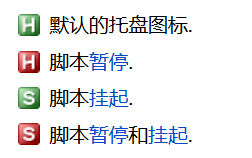

# AutoHotkey自动化脚本语言快速上手


官网：https://autohotkey.com

中文文档：https://wyagd001.github.io/zh-cn/docs/


## 1.体验第一个脚本

首先创建一个“ .ahk ”的文件

```
^q::
	run Notepad.exe
Return
 
; 分号为注释
；^q表示热键，其中^为ctrl
; run 是命令，第二行的意思是打开记事本
；Return 和编程语言一样，结束的意思，表示后边的代码不会执行到
```

保存任意名称，后缀不能改哦，鼠标右键，选择run Script，或者IDE中有运行按钮，执行脚本，会在任务栏的托盘中看到脚本图标，不同图标显示不同的状态。  按下热键，ctrl+q 就可以运行脚本，自动打开记事本了。 

### 托盘图标状态及菜单




右键单击托盘图标以显示托盘菜单, 默认情况下具有以下选项:

- Open - (打开) - 打开脚本的主窗口.
- Help - (帮助) - 打开 AutoHotkey 离线帮助文件.
- Window Spy - (窗口监视器) - 显示关于窗口的各种信息.
- Reload This Script - (重载这个脚本) - 请参阅 Reload.
- Edit This Script - (编辑这个脚本) - 请参阅 Edit.
- Suspend Hotkeys - (挂起热键) - 挂起或取消挂起热键.
- Pause Script - (暂停脚本) - 暂停或取消暂停脚本.
- Exit - (退出) - 退出脚本.


##  键的符号 

快捷键映射更普遍的写法是写成多行，并以return表示命令结束

| #     | !     | ^      | +     | <^>!                             |
| ----- | ----- | ------ | ----- | -------------------------------- |
| win键 | Alt键 | Ctrl键 | Shift | 对于某些具有`Alt Gr`键的电脑而言 |

 其中，`<, >`为修饰符，用于区分成对出现的按键，例如`表示左侧的`Ctrl`。按照这个逻辑理解，`<^>!`应该表示左`Ctrl`+右`Alt`，对于某些具有`Alt Gr`键的电脑而言，则专门指代这个按键。 


## 窗口的热键和热字符串

```
#IfWinActive 
#IfWinExist
```

