一、C 语言是什么？
----------

C语言是是一门经久不衰的计算机编程语言，万物始于C，学好C语言，能让我们为编程之路打下坚实基础。

二、开发环境
---------

> **编译器**
>
> 我们把计算机编程语言称之为高级语言，那什么是低级语言呢？
>
> 在中学物理我们知道：电子元件只能传达 "开" 或 "闭" 两种信息，所以电子元件（即晶体管）之间也只能用这两种方式通信。人们把 "开" 用 1 代替，把 "闭" 用 0 代替。电子计算机在初期时，只能识别 0 和 1 两种信号，所以那个时候只有科学家才能进行编程工作，这在那时候是十分困难的。
>
> 上面提到的 0/1 信号，正好为二进制提供了用武之地，所以我们把最基本的、计算机能够直接读取的语言称之为低级语言。
>
> 在这里，低级语言就是一串由 0 和 1 组成的东西，它转换成汇编语言，进而转换成高级语言，才被我们大多数人学习。
>
> 编译器的作用就是把上面的过程反过来，将我们人能看得懂、接近自然语言的、而且能写出来的高级语言转换成机器能够读懂的低级语言。
>
> 笔者最初使用的编译器是Ｄev C++，然后是 Visual  Studio 2019。我比较喜欢 VS2019，因为它在我写代码的同时能用中文提醒我的错误，但有时候才 vs 不能通过的代码反而在 Dev C++ 里能通过，所以目前我以 vs 为主。
>
> 如果有同学刚接触 C，我建议先使用 Dev C++ 吧，熟悉一下编程环境，如果已经有一定基础了，直接上 vs2019 吧。
>

三、初始 C 语言
---------

### 1. 第一个C语言程序

下面以 Dev C++为例

（1）先新建源文件：文件 -> 新建 -> 源代码

 （2）写预处理命令，写主函数，建立基本框架

```c
#include<stdio.h>
//主函数的一种写法
int main()
{
	return 0;
}

//主函数的另一种写法
void main()
{
    
}
```

解释：

- 尖括号 (<>) 中的 stdio.h 叫标准输入输出函数，即 standard input output.header

- #include 是一种预处理命令，它的作用是找到尖括号（或者英文双引号）中的文件，并将它包含到当前文件，被包含的文件中的文本将替换源代码文件（就是我们正在编写的东西）中的 #include 指令。

看到上面那段话是不是很懵呢，说白了：尖括号里面的东西有我们等下写代码要用的东西，它所包含的代码会帮我们实现某些功能，它只是个名字，实际上它包含了不少代码。因为那某个功能我们接下来要用很多次，如果每次都把尖括号里面的东西打出来，就太麻烦了！而 #include 就用一行代码代替了这么多代码，是不是方便了许多？

**举个栗子** 

如果接下来我们要用到从键盘输入或从屏幕输出，那我们就需要 #include<stdio.h> 来简化我们实现输入和输出功能的步骤。

这里说得有点啰嗦，我刚接触这个的时候很懵：为什么每个函数都要加上 #include<stdio.h> 呢？为什么啰嗦这么多呢：如果有初学者看到我的文章，那我希望他能懂: D

忘了说了，第二种主函数这种写法已经是远古版本了，最好写第一种。

一个程序 / 工程只能有一个主函数（  main（）），它是程序 / 工程的入口。注意 main 不要写成 mian！！

### 2. 数据类型

```
char//字符数据类型//就是不是数字的字符
short//短整型//就是数字小（绝对值）的整数，很少用
int //整型//就是整数
long//长整型//就是数字（绝对值）大的整数
long long//更长的整型//很少用
float//单精度浮点数//就是小数
double//双精度浮点数//小数位数多的小数
```

> **为什么会出现这么多类型？**
>
> ——因为我们现实生活中要用到整数，小数呀
>
> 那为什么整数有 int 和 short 还用 long、long long，小数有 float、double 这么多种类呢？为啥不只用一种数据类型来表示呢？
>
> ——这个问题问得好（精神分裂 ing）。单看英文字母和中文字符的复杂程度应该不难猜想：不同字符在计算机中所占大小是不同的，让我简要介绍计算机中的储存单位：最小的单位是 bit，8bit = 1Byte，1024Byte = 1KB，接着是 MB，GB，TB 等。bit（比特）是最小单位。这里说个题外话，不少人在办理宽带有这样的困惑：为什么我明明买的是 200M 宽带呀，为什么最高才十几二十兆每秒呢？原因是：运营商所宣传的 200M 宽带实际上是宽带接入的速率为 200Mbps，这里的 B 指的是 Byte（字节），换算下来 200M 宽带理论上峰速为 25.6MB/s。这不重要，知道就好，让我们跳回来。事实上，不同数据类型在内存中所占大小是不一样的，如果用大小的盒子装蛋糕，蛋糕有大有小，难免造成空间的浪费，所以人们规定了不同的数据类型，以便空间被物尽其用。
>
> 在这里有一个很重要的思想，我称之为黑屋思想：把内存想象成一个个小黑屋，里面存放着我们想要存进的东西，也存着我们不能动的东西，当然也存着我们想取的东西。
>

### 2.1 数据类型的长度

```c
#include <stdio.h>

int main() {
    // 我的第一个C语言程序
    printf("Hello, World!\n");

    // 数据类型，sizeof() 判断数据类型
    // sizeof 运算符来查询各种基本数据类型在当前系统中所占的字节数
    printf("%d\n", sizeof(char));       //1
    printf("%d\n", sizeof(int));        //4
    printf("%d\n", sizeof(short));      //2
    printf("%d\n", sizeof(long));       //4
    printf("%d\n", sizeof(long long));  //8
    printf("%d\n", sizeof(float));      //4
    printf("%d\n", sizeof(double));     //8
    return 0;
}
```

> sizeof() 判断数据类型或者表达式长度的运算符，sizeof() 不是函数，后面会介绍
>
> C语言规定 sizeof(long long) >= sizeof(long)，其他以此类推，上面的结果因编译器和操作平台而异。
>

### 3. 变量&&常量

生活中的有些值是不变的（比如：圆周率，性别，身份证号码，血型等等）  
有些值是可变的（比如：年龄，体重，薪资）。

### 3.1 如何定义变量

格式如下：变量类型  （空格）变量名（自己起）；

```c
int pokes = 0
```

最好初始化变量，避免脏数据影响后续调试，如 int a = 0；如果变量名有实际含义，最好用对应的英文（再不行就拼音，或英文简写）表示，后续也会明白。  

### 3.2 变量的分类 

局部变量 && 全局变量

 

顾名思义，全局变量就是整个工程都能用的，而局部变量只能在 {} 内部使用，这里的 {} 不仅限于主函数的大括号，在后面的循环或判断语句中的 {} 也同样适用。

**// 如果**全局变量和局部变量名字一样呢？是谁起作用呢？


显然，在这里局部变量会覆盖掉同名的全局变量。 

这里简要介绍 printf(),scanf() 函数，顾名思义，前者是打印，后者是扫描，读取（f 是函数的意思），从键盘读取输入，它们是被包含在 stdio.h 头文件中的。gets() && puts() 也用同样的功能，具体差异会在后续文章解释。

### 3.3 变量的作用域和生命周期

**1. 变量的作用域**

作用域（scope，这个词要记住，后面编译器报错可能会出现）是程序设计概念，通常来说，一段程序代码中所用到的名字并不总是有效 / 可用的，而限定这个名字的可用性的代码范围就是这个名字的作用域。

1. 局部变量的作用域是变量所在的局部范围。（就是大括号里边的变量**只能**在大括号里用）  
2. 全局变量的作用域是整个工程。（就是大括号外边的变量**在哪都能用**）                    

**2. 生命周期**

变量的生命周期指的是变量的创建到变量的销毁之间的一个时间段  
1. 局部变量的生命周期是：进入作用域生命周期开始，出作用域生命周期结束。（大括号大括号！）  
2. 全局变量的生命周期是：整个程序的生命周期。（在哪都行！）   

§ 看完了吗？用人话来说**作用域就是变量在哪能用，生命周期就是它啥时候产生，啥时候消失。**

### 3.4 常量

#### 3.4.1 字面常量

是指可以用字符串表示的常量，包括整型常量，字符型常量，字符串常量，也可以是结构型的符号常量。

#### 3.4.2 const修饰常变量

首先来看没有被修饰的变量：

```c
#include <stdio.h>

int main() {

    // 定义一个变量
    int a = 0;
    printf("%d\n", a);  //0
    // 修改变量a的值
    a = 1;
    printf("%d\n", a);	//1
    return 0;
}
```

显然，未被修饰的变量的值是可以被改变的

再来看被 const 修饰的变量

```c
#include <stdio.h>

int main() {

    // const 修饰的变量,变成只读状态
    const int a = 0;
    printf("%d\n", a);
    // 修改变量a的值
    a = 1;  			//直接报错 a = 1;无法修改只读变量
    printf("%d\n", a);
    return 0;
}
```

编译器告诉我们，a 的值是不能改变的，也就是说，它是个常量，但不完全是，人们把它称为**常变量**。原因是：用 const 修饰的变量只是在语法上将它作为常量，但它本质还是变量，了解即可。 

> 更新于22/10/3：
>
> 关于 “常变量” 的理解：用 const 修饰的变量，无论是全局变量还是局部变量，生存周期都是程序从运行开始到运行结束，也就是说，使用 const 修饰过的局部变量有了「静态特性」。什么变量具有静态属性？我们知道全局变量是静态的，静态的生存周期就是程序运行的整个过程。但是一定要区分的是：用 const 修饰过的局部变量只是有了「静态特性」，并没有说它变成了「静态变量」。
>
> 之所以把 const 放在最后，是因为理解它的「静态特性」需要理解全局变量和局部变量。
>

####  3.4.3 define定义常量

```c
#include<stdio.h>
#define MAX 100
int main() {
    printf("%d\n", MAX); //100
    return 0;
}
```

看图里的代码可以知道,格式：

```
#define 常量名 值
```

在这里常量名和值之间不需要等号。

#### 3.4.4. 枚举常量

```c
#define MON  1
#define TUE  2
#define WED  3
#define THU  4
#define FRI  5
#define SAT  6
#define SUN  7
```

假设我们要用到星期一到星期五7个变量，如果用 #define 的方法定义变量，我们需要用 7 行代码，而使用 enum（枚举）常量能用更少的代码表示相同的意思。

```c
enum DAY
{
      MON = 0, TUE, WED, THU, FRI, SAT, SUN
};
```

第一个枚举成员的默认值为整型的 0，（在这里我用 = 0 来表示，实际上它被省略了）后续枚举成员的值在前一个成员上加 1，以此类推。

当然我们可以在定义时修改任意枚举成员的值：

```c
enum DAY
{
      MON = 1, TUE, WED = 100, THU, FRI, SAT, SUN
};
```

对于没有指定值的枚举元素，其值为前一元素加 1。在这里 TUE = 2， THU = 101，以此类推。

枚举常量先介绍到这里，实际上初学者的后续项目中用得较少，至少我现在还没遇到过（大一期末）。

打印结果如下：

```c
#include <stdio.h>

int main() {
    enum DAY {
        MON = 1, TUE, WED = 100, THU, FRI, SAT, SUN
    };
    printf("%d %d %d", TUE, THU, FRI);    //2 101 102
}

```


### 4.字符串&&转义字符

--------------------------------------------------------------------------------------------------------------

#### 4.1 字符串

```
"hello world!"
```

形如这样被双引号扩起来的一串字符称为字符串。

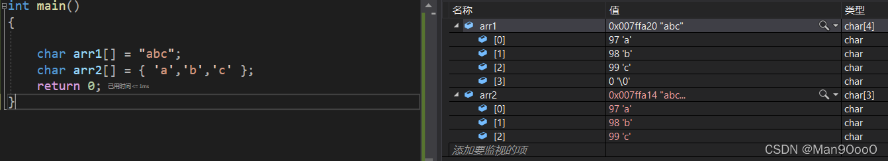

在 vs2019 编译器中键入以上代码，按下 f10 键，依次点击调试 -> 窗口 -> 监视。结果如图。

> 我在定义数组时并未初始化数组大小，因为编译器会根据输入的内容判定数组大小。由监视窗口中的值和类型栏中可以看出，虽然显示的是相同的内容，但是由双引号引起的字符串多了一个'\0'，它在数组中是有实际大小的。由于人们要对字符串进行一系列的处理，但是我们不是每次都能知道一个文本中的字符个数，若要对处理它，很难保证不越界且不浪费内存，于是人们想到将'**\0'当作字符串结束的标志**（它是一个转义字符，后面会介绍），这样人们在处理字符串的时候就不必担心数组越界和未知长度的问题了。
>

接下来我们定义三个数组，arr1 是一个字符串，arr2 和 arr3 都是字符数组，它们的区别在于 arr2 没'\0', 而 arr3 有，这样的区别会带来怎样的影响呢？让我们打印一下。 

```c
#include <stdio.h>
//
// Created by Administrator on 25-6-14.
//
int main() {
    char arr1[] ="abc";
    char arr2[] ={'a','b','c'};
    char arr3[] ={'a','b','c','\0'};

    printf("%s\n", arr1);   //abc
    printf("%s\n", arr2);   //abcabc
    printf("%s\n", arr3);   //abc
    return 0;
}
```

结果非常的 amazing 啊，中间怎么有个奇怪的东西？

我们先看一样的 arr1 和 arr3，在监视窗口中，它们包含的成员完全相同，当然，我们可以认为字符数组加上'\0'就是一个字符串，那为什么没'\0'的字符数组 arr2 显示出来但没完全显示出来呢？上面我们提到,'\0'是字符串的结束标志（这里恰好证实了字符数组加上'\0'就是一个字符串这一猜想），打印函数只有碰到'\0'才会停下来，arr2 数组里并不包含，所以机器就一直找,因此arr2打印出来就很奇怪！


        用一张图简要表示数组在内存中是如何被处理的。 

#### 4.2 转义字符

当我想打印路径 c:\code\test.c，结果为什么不是想象中的样子呢？

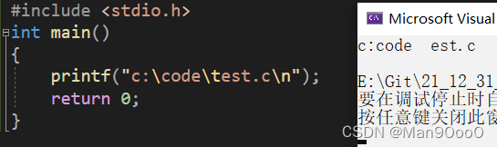

        这里就不得不提一下转义字符了。转义字符顾名思义就是转变意思。  
下面看一些转义字符。

\'表示单引号'

\"表示双引号"

\\ 表示一个反斜杠

\n 表示换行

\r 表示回车

\t 表示水平制表符，相当于按下 tab 键，还有一些转义字符没有提及，因为刚开始用的很少


补充一下 ASCII 码表


简单来说，因为机器内存中只能存储二进制 0 和 1，所以当我们想要使用各式各样的符号时，只要使用对应的 ASCII 码，编译器会将它们转换成二进制编码，进而被机器识别。现在请将 0，a，A 对应的 ascii 码值记住。 

### 5.判断&&选择语句 

--------------

####  5.1. if语句

从字面上看容易理解：如果怎样就执行，不怎样就不执行。格式如下：

> if(判断条件){
>     执行内容
> }

如果没有 {}，if 语句只执行紧跟它的第一个语句，因为 ";" 表示执行语句的终止。所以 if 语句和后面的各种语句，即使要执行的语句只有一句，也要加上花括号，以便以后更好地维护程序，也增加了程序的可读性。

人们规定判断结果为真的表达式的值为 1，否则为 0；

#### 5.2 if...else语句

一个 **if 语句** 后可跟一个 **else 语句**，else 语句在它之后的语句结果为假时执行。

```c
#include<stdio.h>
int main()
{
	int n = 0;
	if (n == 0)
	{
		printf("hello\n");
	}
	else
	{
		printf("world\n");
	}
	return 0;
}
```

显然，打印结果为 hello。

#### 5.3 if...else if...else 语句

一个if语句后可跟一个else if...else语句。三个部分都最好加上花括号。也就是说，else if 可以没有，else 也可以没有，但是 else if 有大于 0 个时，必须有 else。且 else 必须在最后。这里的各个 else if 互不干扰，只要条件符合，就执行语句后括号的内容，判断的变量必须与 if 括号中的一致。

```c
#include <stdio.h>
int main() {
    int score = 75;
    if (score >= 90) {
        printf("A\n");
    } else if (score >= 80) {
        printf("B\n");
    } else if (score >= 60) {
        printf("C\n");
    } else {
        printf("不及格\n");
    }
    return 0;
}
```

当然，if 语句还可以嵌套，由于这是初始 C，时间和篇幅有限，后面再介绍。

### 6.switch语句

> - switch 括号内的常量表达式，必须是一个整型或枚举类型 (上面有提到)。
>
> - case 语句可以有任意个, case 后跟一个对应 switch 括号内相同数据类型的值和一个冒号（前面需要一个空格）。
>
> - 当 case 内的浴具语句执行完毕后，如果未遇到 break，将会继续执行下一个语句，直到遇见 break 或直到 switc 语句终止。当然，break 不是必要的。
>
> - default 语句 用于 switch 接收的常量或枚举类型都不等于上面 case 语句冒号后的常量或枚举常量，同样，default 也不是必要的。
>
> - case 语句和 default 语句后最好加上花括号。

看着真麻烦，话不多说，上代码：（还是用截图吧，看得清楚些）

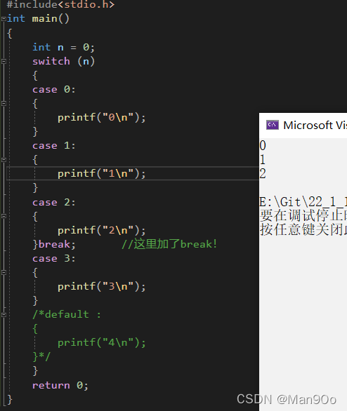

        这里打印结果为 0，1，2 ，是因为第一个 case 语句就像一个入口，如果没遇到 break，程序将会一直执行。这里的入口位置是任意的。


当我修改 n 的值以后，对于此时的 n，入口发生改变了。


当我再次修改变量 n 的值且加入 default 语句结果如上。因为上面的 case 语句中没有对应的入口，只能通过 default 进入 switch 语句。

当然，switch 语句也可以嵌套。

### 7.循环语句

-----

前面我们依次简要介绍了顺序结构、选择结构，接下来我们要介绍循环结构。

可能对大多数初学者并没有这么夸张，但笔者当初初学循环时，似乎因为走了一会神，之后的就懵懵懂懂，一知半解，在实验课束手无策，甚至一度怀疑自己的智商是否是编程这块料，如此恶性循环。好在经过我的恶补还有许多练习，使我稍微掌握了循环结构的使用。我从这里悟到一个编程学习者必须具备的素质，**不要光听不做，不要眼高手低，动手实践才是真正学习编程！！**

在这里再插一句：**当你遇到 bug 时，尽量先自己找 bug，因为只有经历过痛苦才会刻骨铭心。**

#### 7.1 for 循环

        我相信读者比我更聪明，且看介绍。

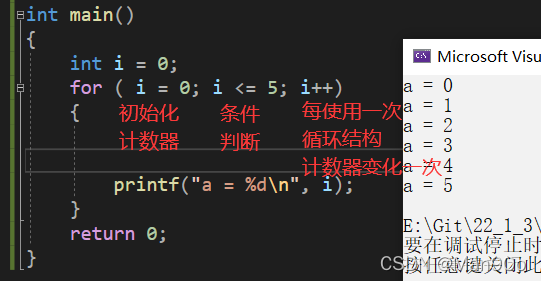

         规范、易读的写法如上，也可以在 for 后的括号定义计数器变量。但有些编译器会报错。

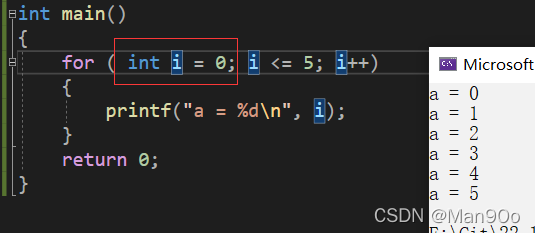

         也可以这样写：

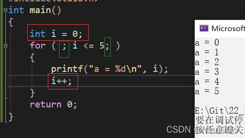

         计数器初始化在 for 循环外也可，计数器变化在花括号内也可，由上可知：for 括号内的两个顿号是必须要写的的，且不论执行语句有多少，最好加上花括号。

        在这里有个初学者经常犯的错误：计数器的位置。


首先说一下机器执行 for 循环的顺序 (常规结构)： 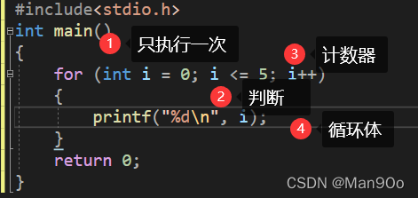

        也就是说，for 后面括号内语句的执行并不是完全按顺序的。当我把计数器 i++ 放在花括号内，且把它放在不是最后的位置，那它就不是最后执行的语句了，所以要让它作为计数器，就要把它放在最后。但是笔者认为这样的可读性不算好，也不是很美观，非必要情况下还是把计数器放在括号里吧。

        计数器的地位举足轻重，如果没有它，条件判断的结果永为真，这将是一个死循环。并不是所有的死循环都是错误的，因为我们总有些事情需要机器一直执行，后面我们会用更简洁的形式实现死循环。只有当条件判断的结果为假时，循环才会停止。

        for 循环括号内的判断语句至少写一句，很多时候，我们要在 for 循环语句内添加判断语句，其实也可以将 判断语句写在上面的括号内，不过这样写还是可读性不是很好，也不算美观（至少对初学者是这样的），知道即可。

        在这里强调一下**计数器初始化**的重要性：

        我用两个相同的循环结构，是否能打印两组 "1 2 3 4 5" 呢？ 


        从图上我们知道，只打印了一组，我们把第二个条件判断改一下：

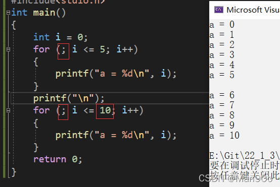

        两个循环结构我都没有初始化计数器，当然，对于第一个循环实际上它已经在定义变量 i 时被初始化了。当程序走完第一个循环结构时，i 的值为 6（以为是 5 的同学再思考一下），所以第二个循环打印不出来值，因为 6>5，所以第二个循环根本进不去，于是程序终止。      

        解决它有两个办法：

      （1）定义不同变量用于不同计数器，这样各个计数器之间就不会互相干扰了。 

      （2）每次使用计数器之前都初始化它，即使用规范格式。

       这个小问题，每隔一段时间就会让我恼火一阵子，有时是真的找不出来错误，因为我不是每次写的格式都是一样的，所以说规范地写代码很重要啊！  

#### 7.2 while 循环

        结构如下：

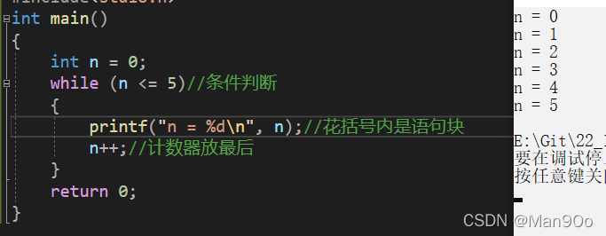

        计数器的位置同样会影响打印结果。 

        可以发现，while 循环只不过是把条件判断留在了括号中，变量初始化和计数器放在了其他地方。

用法和注意点与 for 循环大致相同，区别在今后的博客中细说。

#### 7.3 do...[while 语句](https://so.csdn.net/so/search?q=while%E8%AF%AD%E5%8F%A5&spm=1001.2101.3001.7020)

目前不太需要，一般用在菜单选项的时候，到时候就知道了。

学校考试的要点：

```
int i = 0;
do
{
   i++;
}while(...)
```

如果 while 括号中结果为假，do 中的操作都是一定先执行的，也就是说 do...while 循环至少执行一次。 

6. 函数
-----

**个人理解** 

        这里的函数不是数学中的函数，不太喜欢数学的同学先别关掉: D。在我看来，函数就像生活中的各种店铺，五金店，电器维修店，服装店...... 它们在我们生活中有着各自的作用。函数的作用就像一个个店铺，把各种具有不同功能的代码打包，就像店铺之间都隔着墙一样。这样的好处是**简化代码**。试想各种店铺混在一起的场景，且结合笔者下面的解释，应该大致能理解函数的作用。

举个栗子


        这里只是举一个十分简单的例子，我想说的是：某些功能实现起来并不难，但实际上往往需要多次使用该功能，由于懒是第一生产力（:D），于是函数诞生了。


         函数名括号内的东西就相当于店铺门，你往门里丢东西，它就会根据它对应的功能返回给你相应的东西。函数先介绍到这里，后续会详细讲。

（新增于 22/9/1）输入输出函数：

        通过上面对众多语法的解释，我经常使用 printf()函数来打印，其实以后如果遇到某些问题难以解决，通过 “打印大法” 经常能化险为夷，快速定位问题。（扯远了），现在列举几种 C 语言输入输出需要注意的方面和它们的常见用法。

**要点**：

*   **必须包含头文件 <stdio.h>**。原因是：最初提到 stdio，它是**标准输入输出。 why？**因为 C 语言没有内置输入输出函数，在最初期 C 语言流行的时候，很多公司都是自己写的输入输出函数，但是它们或多或少都有区别，这样某个公司写的软件或者接口可移植性就很差，于是有个叫 “标准委员会” 的就出来规定了输入输出标准。举一反三，无规矩不成方圆，各种 “标准” 也就成了语言内置的 “库” 了。（库在学习的过程中会渐渐理解它）
*   如果指定了类型，人必须按照双引号中的格式输入，那么机器也肯定会按照格式输出，详情如下。

**常见用法**：

        下面通过输入输出的几种组合解释：


请注意：如果你现在不知道输入输出语句，那就先记住它的格式，双引号，逗号，括号什么的。

 运行以上代码，会有一个光标在闪动，输入 100，回车。代码中打印了三次，不同的是第二次，添加了一个换行符。其中输入语句中最后的是 &（取地址），现在只要记住输入要这个符号即可。

用其他的呢？

 

        运行上述程序，输入 6699 回车，且不论打印的数字位置如何，它们却只有 2 位。原因是：可以把输入输出语句中的双引号以及它里面的东西翻译成 “格式”，输入输出就是按格式走的，是强制的。

        这个 % 多少 d，“多少” 代表宽度，你看即使我输入 4 个数字，那它也只读取前两个数字。下面两个数字位置不同的原因是：打印函数的宽度正数靠右，负数靠左。如果没有规定宽度，那么也就没有绝对的靠右靠左对齐可言，不过从左到右习惯来讲，不规定宽度默认是靠左的。请注意对齐是在有移动空间的前提下才会体现出来。就像后面两个打印函数，长度（绝对值）都是 4，是大于读取的 2 位数字的长度的。

         再来一个！


         运行上面的程序，但是请注意打印的格式与要打印的变量的类型不符合，就这段代码而言，打印的是'A'和'B'的 ASCII 码（还记得 a 的 ASCII 码么？）。从格式上的强制性来说，规定打印的格式十分重要，不是说一定要类型符合，经常是灵活使用。比如有一些题比如就是要打印字符的 ASCII 值，那么直接以 %d 打印字符就 ok；再比如可能要遍历 A~Z，直接在循环 65~106 中用 %c 打印即可。

 最后一个！


        运行程序。这次打印的是一个浮点数，通过最后一个打印语句可以知道，%f 默认打印的是 保留 6 位小数。而在百分号和 f 之间的'.2'就代表小数点后保留两位。经常会在写应用题的时候遇到保留 xx 位小数这样的要求。

        在这里再次强调动手做的重要性，看得懂连入门都不算，当然动手也需要熟练~

7. 数组
-----

        数组的**定义**：一组**相同类型**元素的集合 

#### 1. 一维数组 

**声明 && 初始化数组**

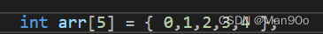

        从左至右依次为数组数据类型，数组名，数组元素个数，数组元素。 

        在这里,"[ ]" 内的数字可以不用写

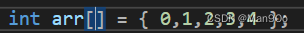，编译器会根据元素个数来改变它

**数组的下标**


        即数组的下标是从 0 开始的，这点需要初学者下意识地在练习中成为肌肉记忆。

**数组的使用** 

        数组的使用，单看它的形式，也就 [] 内的数字可以变化，当我想把数组中的元素打印出来呢

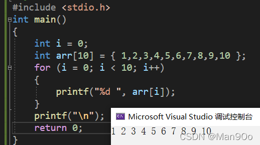

                在这里，i 的区间为 [0,10), 是有直观意义的，它表示我们操作了数组中下标为 0 到 9 的每个元素。

        更多知识点与细节将在后续发出~

8. 操作符
------

（简单介绍）

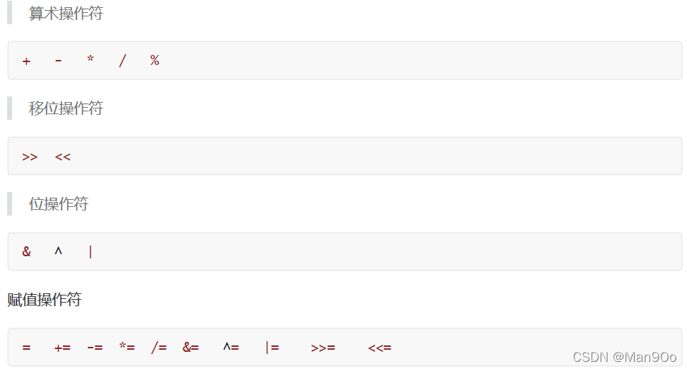

        算数操作符和赋值操作符的前五个相信大家都知道，这里提一下位操作符'&'，当我们每次使用 scanf 函数时，总是要在变量名前加上 &，& 变量 a 的意思是取变量 a 的地址，这是 & 符号的作用之一。

         对于上面的单目操作符和关系操作符，我们可能对解引用操作符不太熟悉（*)，它和刚才提到的 & 符号取变量地址是对应的，例如：*a = &a，它们是完全等价的。不太明白没关系，这里以后会重点讲。

         这个条件操作符我们总是不容易想到，不经常使用，但有时它能有种四两拨千斤的效果，能简化不少。

        这个操作符的意思是：当表达式一的结果为真，整个表达式结果就为表达式 2，否则结果为表达式 3。例如：

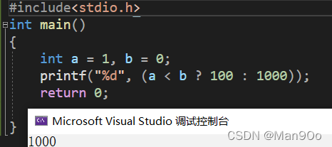

        逗号表达式的意思就是一个语句由 N 个被逗号分隔的子语句（实际上不能称之为语句）组成，那么这个语句的结果就为最后一个子语句的结果。例如：

 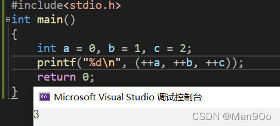

9. 常见关键字
--------

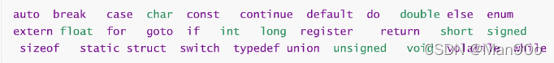

        关键字在此只介绍初学时重要、常见的几个。

#### 1. break

         在 switch 选择语句使用的尤其多，其次是循环语句中。它的作用是一旦条件符合，就跳出整个循环 or 选择语句。例如：

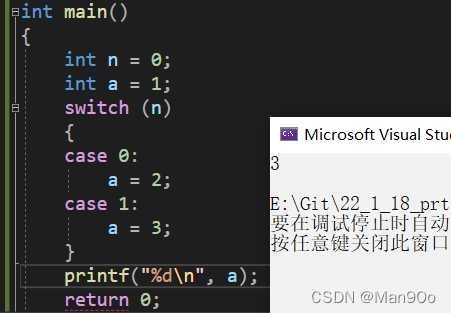


        在这里唯一的不同是在 a = 2 后加了 break，它的作用是阻止语句往下执行。也就是说，switch 语句要么从入口一直执行完毕，要么从入口开始执行，直到遇到 break 终止。

 循环例子如下：


#### 2. continue 

         它常用于循环语句中。它的作用是当符合条件时，continue 后面的语句不再执行，跳出本次循环，再开始下一次循环。

例如：


        理解了 break，continue 自然不难理解。

        当然，break 和 continue 在不同情况下的差异会在后续详细讲。

#### 3. static

        在 C 语言中：  
        static 是用来修饰变量和函数的  
(1). 修饰局部变量

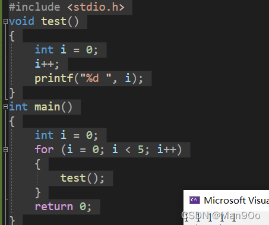

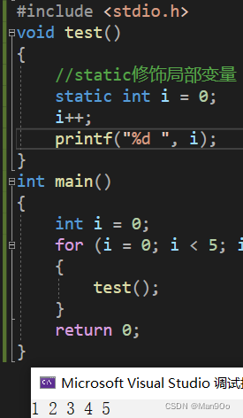

        由第二次的结果来看，函数内的局部变量并没有像第一次一样，每次调用都是为变量 i 开辟内存空间，而是将变量 i 的值保存下来。

**故：  
        static 修饰局部变量改变了变量的生命周期，让静态局部变量超出了作用域后依然存在，直到程序结束时，生命周期才结束。**


(2). 修饰全局变量

        这个例子举起来有些麻烦，姑且让我说说吧：在实际项目中，一个工程中会有至少一个源文件（xxx.c）。当一个全局变量被 static 修饰，这个全局变量就只能在本源文件内使用，不能在其他源文件内使用。（此处忘记全局变量的同学往上翻 ^_^）


(3). 修饰函数

        同上，一个函数被 static 修饰，这个函数就只能在本源文件内使用，不能在其他源文件内使用。

10. 指针
------

        指针和内存管理是 C 语言的双刃剑。

        由于这部分十分重要，所以这里我简要介绍有关指针的基础知识。

**1. 内存**

        内存是电脑上特别重要的存储器，计算机中程序的运行都是在内存中进行的 。所以为了有效的使用内存，就把内存划分成一个个小的内存单元，每个内存单元的大小是 1 个字节。为了能够有效的访问到内存的每个单元，就给内存单元进行了编号，这些编号被称为该内存单元的地址。

        变量是创建内存中的（在内存中分配空间的），每个内存单元都有地址，所以变量也是有地址的。在前面我提到：*a = &a，为什么呢？

        对于等号右边，它表示的是变量 a 的地址，它也是一个具体的值，我得用房间给它住，所以人们规定定义 int *a 存放 a 的地址。**注意：** **在定义指针变量时，* 符号只是表示定义的是一个指针变量，而使用指针变量时 * a 中的 * 符号指的是机器通过存放的 a 的地址找到 a 的值。**

 **1.1** **指针的简单使用**

 

        通过地址的存放，解引用，达到了赋值的目的。 

 11. 结构体
--------

        结构体是 C 语言中特别重要的知识点，结构体使得 C 语言有能力描述复杂类型。比如描述学生，学生包含： 名字 + 年龄 + 性别 + 学号这几项信息。这里只能使用结构体来描述了。直接上图：

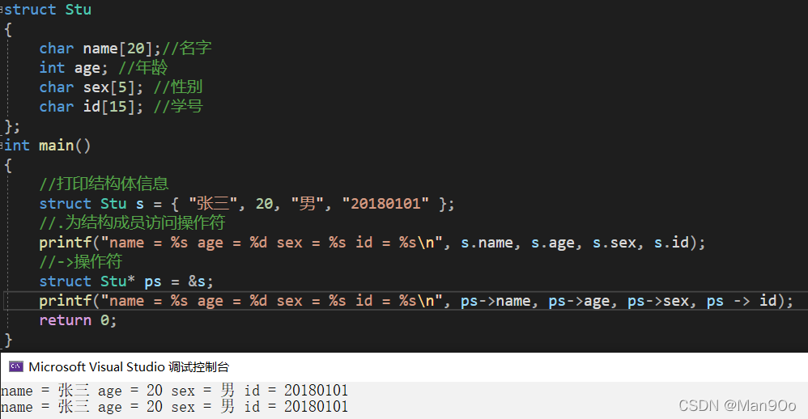

        声明一个结构休类型的一般形式如下：

        struct 结构体名

        {成员列表};

        这个结构体名在本工程中就是一个用户定义的数据类型了，就像 int 那样，不过需要注意的是，定义并初始化结构体时，成员的数据类型要于结构体声明时对应。

        细心的同学会发现，我两次打印时，后面的一坨东西看起来不一样，但结果却完全一致。实际上这与指针有关，在后面也会详细讲。

四、 总结
-----

        关于反思。 

        不知道有没有细心的同学发现我的文章写了很久：21_12_26 ->22_1_18, 实际写的天数大概小于 10 天左右。起初只是为了为迎接期末考试而写的博客，本来是要从头到尾都写一遍了，结果发现太长太长了，所以我把题目改成了 “C 语言初阶”，即使这样，我还是没办法在考试之前写完它，因为 5 号就考完了，直到 13 号放假回家。现在已经是 23：33 了，我在家玩了 3 天，拖延症真的不好啊，百害无利的那种。太容易让人泄气了，恶性循环。

        这篇文章我觉得它烂尾了，函数前面的部分，我写的时候是充满热情的，总是愿意抽出时间写。现在一闲下来，回到家，只要一开始玩就很难停下来（不过比没我以前那么夸张），好在我坚持了下来，终于写完它了。在玩的时候如果去想着学习，对于我来说一定是十分痛苦的，幸运的是，每当我投入时我是感到快乐的，因为这是我喜欢的事！

        看了自己上面写的东西，感觉文不对题（因为我改了题目），好多废话，想重新写，但是上面的绝大部分都是我敲出来的，耗费了我不少精力和时间，有头有尾地做事（瞧瞧这像是拖延症晚期的人说的话吗），如果我把它就这样搁置了，我会难过很久的，因为我又浪费了时间。由于前面的内容没有必要的内容太多，且这篇写这篇博客的目的是让读者初识 C，也就是能看得懂代码，没有必要记忆太多东西，不过也好，前面的东西相对来说对初学者十分重要，讲详细点也并非没有好处。不知道读者的意见如何呢？欢迎评论！

写在最后【建议】【学习、生活、人生计划、心得】
-----------------------

        时间真快，我的大学生活已经已经过了 1/3 了，大四我不算在内，因为我觉得前三年是这辈子（students in CN）唯一能够用一大把可自由支配的时间用来提升自己、寻找 / 做自己热爱的事情的时间段了，其他时间段跟这个阶段比可能没那么纯粹。如果你现在（准）大一 / 大二，千万要做自己的主人——自信、勇敢、独立是剩下的人生需要具备的，你我听过许多道理，一起进步吧。

【学习】

        从大一萌新到现在的大二 “老油条”，有不少事情我认为越早知道越好：

*   适当翘课，挖东补西：如果你的学校一般，不久后你就会发现学校老师教课很一般，水课就不用说了。翘课当然不好，但是烂课对我们个人而言是浪费人生的，而且是黄金阶段的人生，我认为这是非常不值得的。翘课不一定要肉身翘课，精神上翘课也是可以的，因为学校抓的严，我也比较怂，本人常年最后一排，都在干自己的事，完全不用管你认为讲课不好的老师讲的课。**注意，最后一节课或几节课，必须必须必须去，因为老师不仅可能会点名，很多老师会直接划重点，也就是考范围**。但有的学校严，老师可能会暗示。
*   **必须学会自学**：承接上一话题翘课，在不那么重要的课上干自己认为重要的事就是自学。不上老师的烂课，自己在网上（哔哩哔哩或 YouTube、tb/pdd）查找优质课程资源能提高效率和质量，尤其是专业课。自学是大学生必须学会的一门技能，公司招人的时候，也许你面试的是 C++，但是经常会让你转 Java；或者你作为一个新人，入门就给你一大册书，配给你一个指导老师，xx 月后再来面试你，这就是在考察你的学习能力。自学不完全是自己找课学，自学更重要的是查找资源，整合资源的能力，比如你现在在学 C，在网上查找 C 的资料就是自学的过程。牛顿这么牛逼他也是站在巨人的肩膀上，要学会使用工具。
*   保证绩点：大学和高中的成绩评价标准不同，一般而言，如果一门课比较重要，比如高数线代这些大课，那么它的平时分占 30%，如果是像政治类的水课，那么它的平时分占比可能会大一些，占 40%，比例一般不会五五开，具体看学校。就我的经验而言，如果你作业都有交，上课点名没被记（偶尔也是可以的，但不能过分，不管是不是借口，都要找老师说明，老师都懂的，主要是**不要得罪老师**），如果你的最终考试的成绩 ok，平时成绩一定不会差，很大程度来说，一般考试越难的，**平时分也是会跟着你的卷面分走的**。再来说一下水课，如果你想保住你的绩点（可以自己去查绩点是什么），不管是保研还是出国（**留学一般要平均分 80+**），还是为了自尊心，都要知道一些技巧的。还有就是**水课其实有时候很拉学分**，特别是我很讨厌的文科类。**水课的平时分占比较大，**所以尽量不要被老师发现你翘课，水课学期末的作业非常重要，虽然看上去只是抄一篇作文，但是一定要工整，越简单的工作越要让老师看到你的态度，分数自然高一些。
*   考前突击：承接上一点，得到高分跟你学多久其实并没有多大关系。同学可能会纳闷，说反了吧？大学里的课程都是**通过性考试**（至少一般大学是这样的），不是像高考那样的选拔性考试，所以难度不会太大。学校是有题库的，如果你**刷遍前 5-10 年的期末题**（老师没发找学长学姐要），那么你考试里的题非常多的题都是原题，也有很多换汤不换药的。如果老师明确指出考试的题就是课后题，那么 请好好对待它吧，特别是高数线代概率，因为这是考研的基础。虽然很多人说到时候都会忘记重新学，但是你懂的~，还有就是如果你现在不打算读研 / 留学，也不要放下绩点，因为**人的想法会随着阅历而改变的。**回到这个话题，你学习某一门课程，也许并不需要像学校安排的课程需要半个多学期、一个学期学完它，如果只是想拿到高分，也许从考前 2-1 月开始学习一门课程就足够了，当然这只是我的一面之谈，因为我大一第一学期学非专业课的时间拉的很长，备考不是很高效，也浪费了我很多自学编程的时间。大一第二学期的前半学期都在自学专业课，快考试才学其他的，知识点也记得比较清楚。最后说一句，大学生的期末是要人命的...... 尤其是你比较在意绩点但你只想把时间用来学专业课或其他课程的同学。所以考前突击还是要把**战线拉长**一些，要不然期末周很多课排在一起考试一起突击很难受的。

                                                                                                          已经深夜，持续更新 --2022/9/1