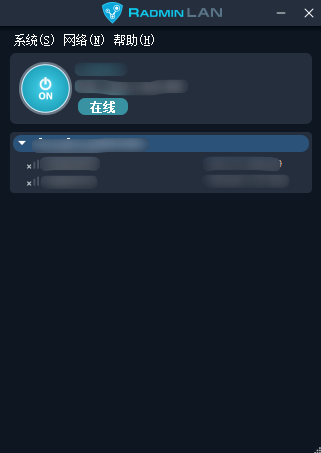

# Radmin VPN

官方下载地址：https://www.radmin-lan.cn/

## RadminVPN介绍

Radmin VPN 的核心原理是在互联网上构建**虚拟局域网（VLAN）**，通过虚拟网卡、NAT 穿透、P2P 直连与端到端加密，让不同地域的设备像在同一局域网内通信，核心依赖虚拟适配、穿透打洞、加密隧道三大技术，无需依赖第三方中转服务器。

## NAT穿透与P2P连接建立

核心依赖**NAT 穿透（打洞）** 技术，解决不同内网设备的通信障碍，优先建立 P2P 直连，仅在穿透失败时通过官方中继服务器转发。

## 端到端加密与安全机制

- 采用**AES-256 加密**保护传输数据，结合 RSA 非对称加密进行密钥交换与身份认证，防止数据被窃取或篡改Radmin VPN。

- 虚拟网络由创建者设置名称与密码，仅授权用户可加入，实现网络隔离与访问控制。

- 遵循**无日志政策**，不收集或存储用户通信数据，保障隐私安全Radmin VPN。

