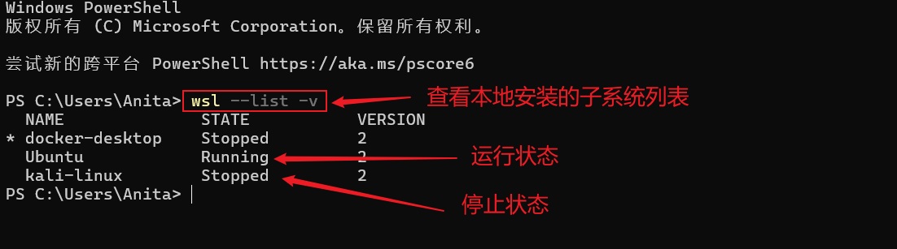

# Linux子系统的安装和基本操作

## windwos功能勾选开启必要功能

‍

打开windwos功能界面，勾选下面的两个选项：

- 适用于Linux的Windows子系统
- 虚拟机平台

安装完成后，需要重启电脑

## 安装wsl

以管理员身份启动cmd

```Python
wsl --install
```

如果发现找不到路径，等提示信息：

```Python
dism.exe /online /enable-feature /featurename:Microsoft-Windows-Subsystem-Linux /all /norestart
dism.exe /online /enable-feature /featurename:VirtualMachinePlatform /all /norestart
```

如果上面这一步失败，可以使用手动下载安装，下载地址：

https://github.com/microsoft/WSL/releases/tag/2.3.26

‍

安装完成后检测一下：

你可以通过以下命令检查 WSL 版本：

```Python
wsl --list --verbose
```

## 安装子系统

‍

使用以下命令查看支持的 Linux 发行版：

```Python
wsl --list --online
```

结果：

```Python
C:\Users\32956>wsl --list --online
以下是可安装的有效分发的列表。
使用 'wsl.exe --install <Distro>' 安装。

NAME                            FRIENDLY NAME
Ubuntu                          Ubuntu
Debian                          Debian GNU/Linux
kali-linux                      Kali Linux Rolling
Ubuntu-18.04                    Ubuntu 18.04 LTS
Ubuntu-20.04                    Ubuntu 20.04 LTS
Ubuntu-22.04                    Ubuntu 22.04 LTS
Ubuntu-24.04                    Ubuntu 24.04 LTS
OracleLinux_7_9                 Oracle Linux 7.9
OracleLinux_8_7                 Oracle Linux 8.7
OracleLinux_9_1                 Oracle Linux 9.1
openSUSE-Leap-15.6              openSUSE Leap 15.6
SUSE-Linux-Enterprise-15-SP5    SUSE Linux Enterprise 15 SP5
SUSE-Linux-Enterprise-15-SP6    SUSE Linux Enterprise 15 SP6
openSUSE-Tumbleweed             openSUSE Tumbleweed
```

### 安装

```Python
wsl --install -d Ubuntu-22.04
wsl --install kali-linux --web-download

#--web-download,可以减少下载失败的几率
```

大部分在国外，下载很慢，请耐心等待！或者使用科学上网。

### 启动

```Python
wsl
```

启动时，启动的是默认的子系统，有时候我们需要将其他版本的子系统设为默认，可以使用下面的命令：

```Python
wsl --set-default kali-linux
```

‍

​

### 查看

```Python
PS C:\Users\Anita> wsl --list -v
  NAME              STATE           VERSION
* docker-desktop    Stopped         2
  Ubuntu            Running         2
  kali-linux        Stopped         2
PS C:\Users\Anita> wsl --set-default kali-linux    ##切换默认
操作成功完成。
PS C:\Users\Anita> wsl --list -v
  NAME              STATE           VERSION
* kali-linux        Stopped         2
  docker-desktop    Stopped         2
  Ubuntu            Running         2
PS C:\Users\Anita>
```

### 关闭

```Python
exit
```

### 删除卸载

```Python
wsl --unregister Ubuntu-22.04
```

### 备份导出

```Python
wsl --export Ubuntu ubuntu.tar
```

### 倒入

```Python
wsl --import Ubuntu D:/wsl C:\Users\93917\Desktop\ubuntu.tar

# Ubuntu 倒入后的name
# D:/wsl  为存放目录
# C:\Users\93917\Desktop\ubuntu.tar  倒入的备份文件
```

## 子系统的迁移

刚开始安装默认都是在C盘，随着使用C盘就变红了，所以我们要迁移到C盘以外的盘，这里以D盘为例：

```Python
# 关闭所有Linux子系统
wsl --shutdown
 
# 查看所有Linux子系统状态
wsl --list --verbose
 
# 导出名为Ubuntu的Linux子系统
wsl --export Ubuntu Ubuntu.tar
 
# 注销Ubuntu子系统
wsl --unregister Ubuntu
 
# 在D盘创建新的WSL文件夹
mkdir D:\WSL\Ubuntu
 
# 将tar文件移动到新位置
move D:\Ubuntu.tar D:\WSL\Ubuntu\Ubuntu.tar
 
# 导入刚才导出的tar文件到新的位置
wsl --import Ubuntu  D:\WSL\Ubuntu\Ubuntu.tar
 
# 删除原始tar文件（可选）
del D:\WSL\Ubuntu\Ubuntu.tar
 
# 此时UbuntuD将作为新的Linux子系统实例运行
```

‍

‍
