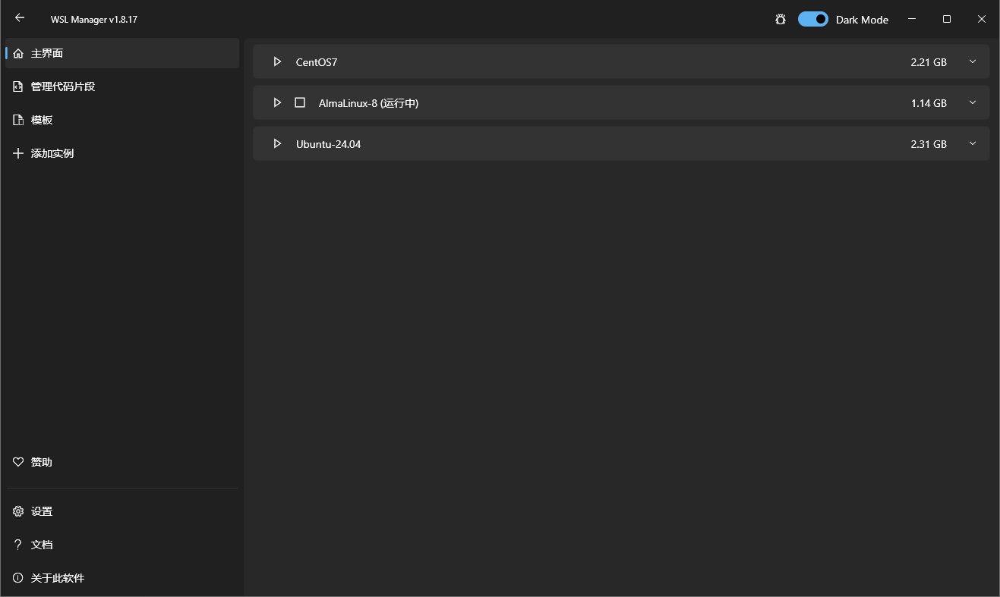

# Linux子系统管理工具WSL2-Distro-Manager

## 工具概述

**WSL2-Distro-Manager：WSL 图形化管理工具详解**

WSL2-Distro-Manager 是一款 **免费开源** 的图形界面（GUI）工具，专为简化 Windows Subsystem for Linux（WSL）发行版的管理而设计。它基于 Windows 设计规范开发，通过直观的可视化操作替代复杂的 WSL 命令行指令，让初学者和专家都能高效管理 WSL 实例，充分发挥 WSL 的功能。

下载地址：

https://github.com/bostrot/wsl2-distro-manager

## 一、核心功能

### 1. 基础 WSL 管理

- 完整生命周期控制：一键安装、卸载、更新、备份（导出）和恢复（导入）WSL 发行版（如 Ubuntu、Debian 等）；
- 实例操作：支持启动、停止、重命名、复制 WSL 实例，查看实例详细属性（如占用空间、注册表键值等）；
- 配置自定义：直接修改 WSL 实例的设置（如内存分配、网络配置），无需手动编辑 `.wslconfig` 文件。

### 2. 高级增强功能

- Docker 镜像直用：无需安装 Docker，可直接拉取 Docker 镜像作为 WSL 实例的基础系统；
- 容器支持：下载并使用 Turnkey 或其他 LXC 容器（实验性功能，已测试 Turnkey WordPress 等场景）；
- 快速操作：预定义脚本并直接在实例上执行，快速完成重复性配置（如环境初始化、软件安装）；
- 自定义仓库：支持使用自有仓库的 rootfs（根文件系统）或 LXC 容器，灵活扩展系统来源；
- 跨设备共享：可将 WSL 发行版导出为镜像，在多台机器间共享复用。

### 3. 便捷工具特性

- 桌面快捷方式：为 WSL 实例创建自定义图标和快捷方式，一键启动；
- 自定义用户初始化：新建 WSL 实例时可直接配置自定义用户账户，无需后续命令行设置；
- 多语言支持：包含中文（简 / 繁）等多种语言，适配不同用户习惯。

## 二、安装方式

支持多种安装渠道，推荐优先选择官方维护的版本：

| 安装方式        | 操作步骤                                                     | 说明                                                 |
| --------------- | ------------------------------------------------------------ | ---------------------------------------------------- |
| Microsoft Store | 打开微软应用商店，搜索「WSL Manager」，点击安装              | 官方推荐，自动更新，最稳定可靠                       |
| 直接下载        | 访问 [GitHub Releases 页面](https://github.com/bostrot/wsl2-distro-manager/releases)，下载最新版 zip 压缩包，解压后运行 `WSL2-Distro-Manager.exe` | 适合无法访问应用商店的场景，需手动更新               |
| Winget          | 命令行执行 `winget install bostrot.wslmanager`               | 注意：Winget 包可能过时，建议优先选择应用商店版本    |
| Chocolatey      | 命令行执行 `choco install wsl2-distro-manager`               | 社区维护（非官方），稳定性依赖社区更新               |
| 夜间构建版      | 通过 [夜间构建链接](https://nightly.link/bostrot/wsl2-distro-manager/workflows/releaser/main/wsl2-distro-manager-nightly-archive.zip) 下载 | 包含最新开发特性，可能存在未测试的功能，适合进阶用户 |

### 手动构建（进阶）

若需自定义功能，可通过 Flutter 手动构建：

1. 安装 Flutter 并启用 Windows 桌面支持：`flutter config --enable-windows-desktop`；
2. 更新 Flutter：`flutter upgrade`；
3. 构建项目：`flutter build windows`；
4. 运行调试：`flutter run -d windows`。

## 三、使用流程（快速上手）

1. **前提条件**：已在 Windows 10/11 中启用 WSL 2（需开启「虚拟机平台」和「适用于 Linux 的 Windows 子系统」功能，重启后安装 WSL 2 内核）；
2. **启动工具**：安装完成后，运行 WSL2-Distro-Manager，主界面将列出已安装的 WSL 实例；
3. **核心操作**：
   - 安装新发行版：点击「Add」，选择系统镜像（或自定义 rootfs），跟随向导完成安装；
   - 管理现有实例：右键点击实例，可选择启动、备份、重命名、删除等操作；
   - 快速配置：通过「Quick Actions」导入预定义脚本，一键完成环境配置（如安装 Node.js、Docker 等）；
   - 导入 / 导出：通过「Import」导入本地 tarball 镜像，或通过「Export」备份实例为 tarball 文件。

## 四、优缺点分析

### 优点

1. 图形化操作降低门槛，无需记忆复杂的 WSL 命令（如 `wsl --import`、`wsl --set-version` 等）；
2. 功能全面，覆盖从基础管理到高级定制的全场景需求，支持 Docker 镜像、LXC 容器等扩展用法；
3. 开源免费，社区活跃，更新频繁（最新稳定版为 v1.8.2，持续修复 bug 和新增功能）；
4. 适配 Windows 设计风格，界面简洁直观，学习成本低。

### 缺点

1. 部分高级功能（如 LXC 容器支持）仍处于实验阶段，可能存在兼容性问题；
2. 第三方安装渠道（如 Chocolatey、Winget）的版本更新滞后于官方；
3. 依赖 WSL 2 环境，不支持 WSL 1 或旧版 Windows 系统；
4. 夜间构建版可能存在未测试的 bug，稳定性不如正式版。

## 五、适用人群

- WSL 初学者：无需命令行即可快速管理 Linux 发行版；
- 多环境开发者：需要切换、备份多个 WSL 实例（如开发 / 测试环境分离）；
- 效率追求者：通过快速操作、脚本自动化简化重复配置；
- 进阶用户：支持自定义仓库、手动构建，满足个性化需求。

## 六、相关资源

- 官方文档：[wslmanager.bostrot.com](https://wslmanager.bostrot.com/)；
- 源码仓库：[GitHub - bostrot/wsl2-distro-manager](https://github.com/bostrot/wsl2-distro-manager)（可提交 issue 或贡献代码）；
- 版本更新日志：[Releases 页面](https://github.com/bostrot/wsl2-distro-manager/releases)（查看功能迭代和 bug 修复记录）。