# SoftEther centos 服务器搭建及客户端连接

> 推荐一个主页：https://github.com/hanxinkong

## 下载管理端

> 下载地址 https://www.softether-download.com/cn.aspx?product=softether

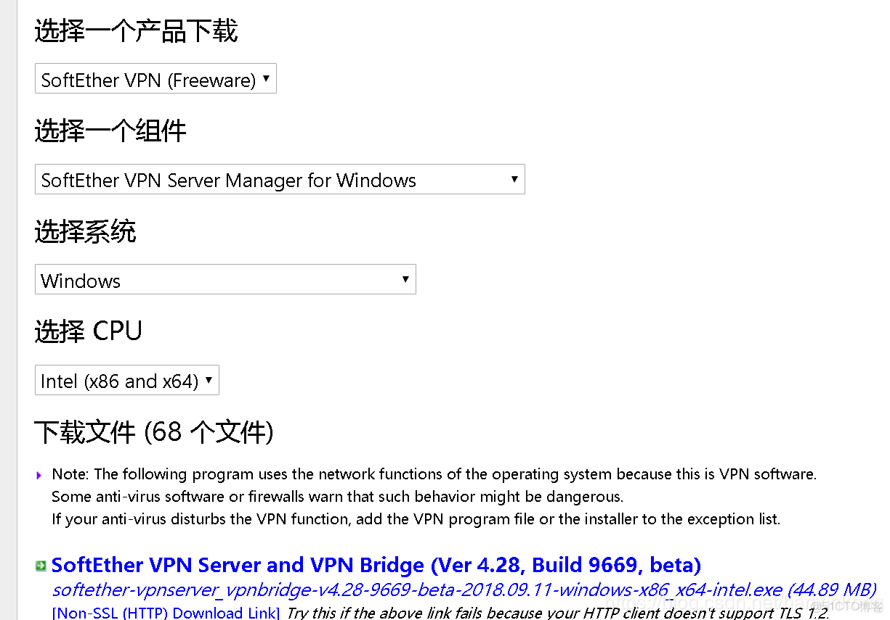

## 安装管理端

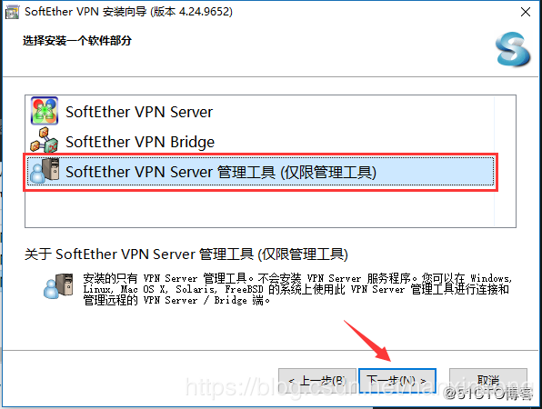

## 配置管理端

新设置

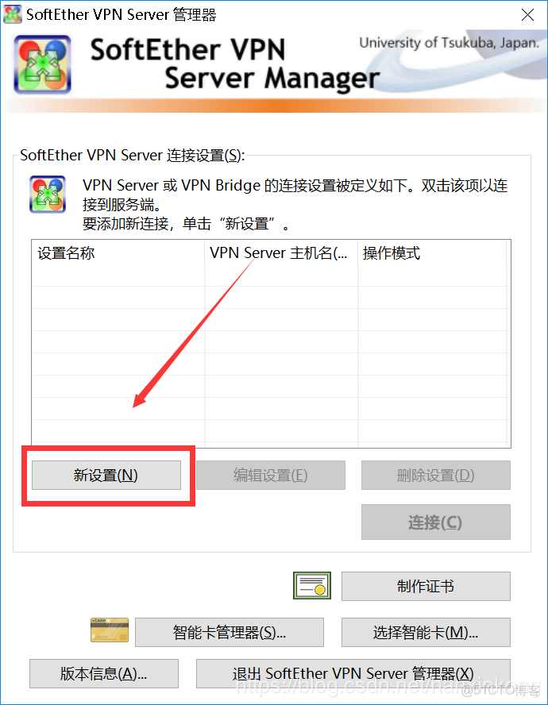

## 配置参数

以下红框内的参数都很重要。

- 设置名，随便起一个
- 主机名，你的WAN口地址
- 端口号：你的WAN口开放的端口
- 密码：用于防止别人乱修改配置

填写相应信息

> 连接

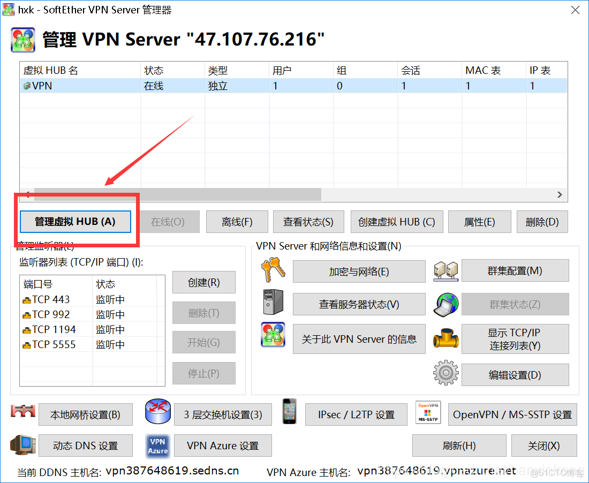

> 编辑服务器

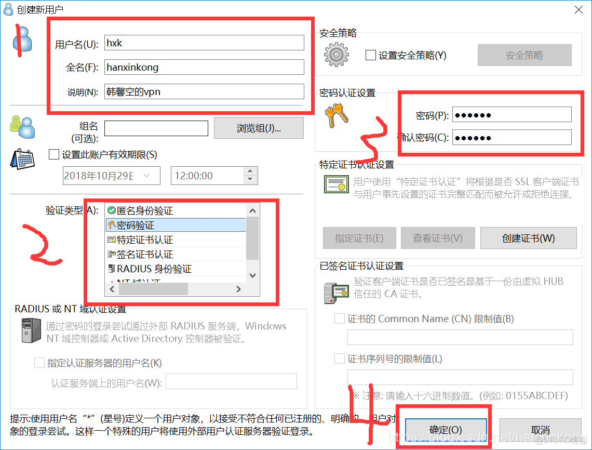

> 添加用户

> 配置 NAT 和 DHCP

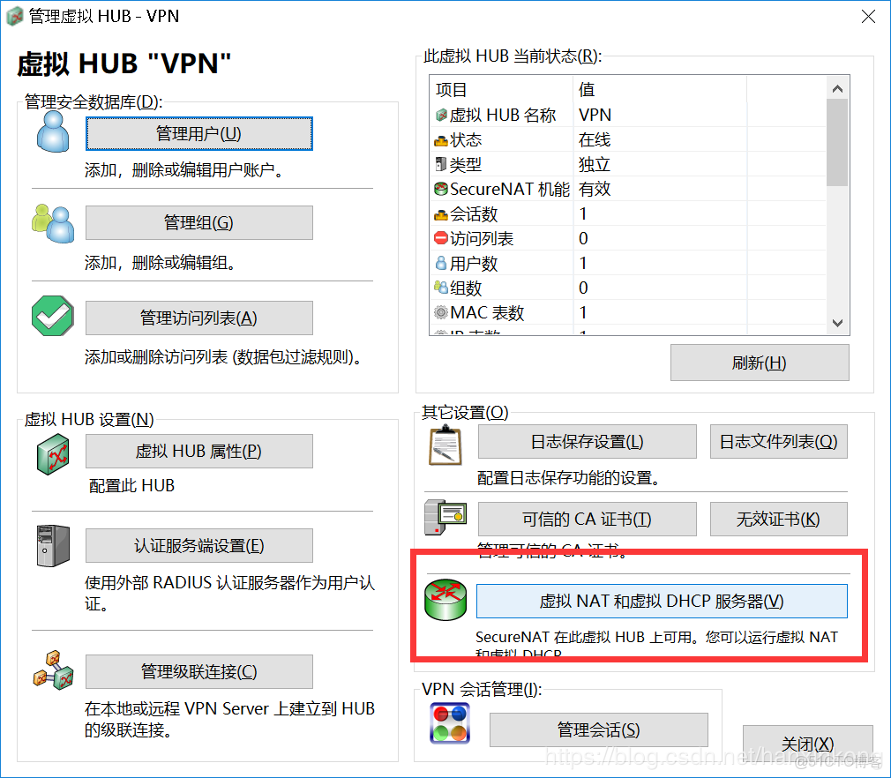

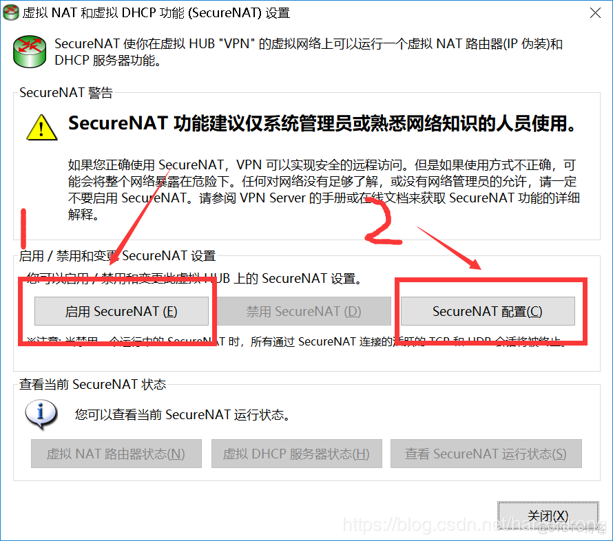

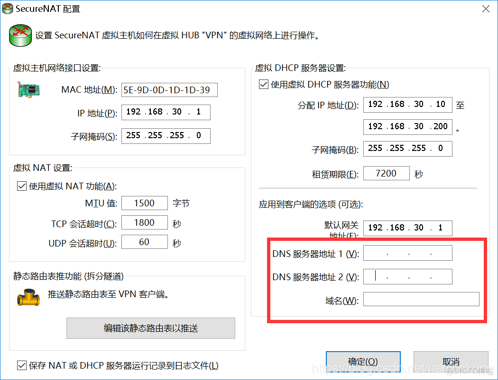

> 产生配置文件 ，open*** 可直接调用

> 到此管理端配置好了

5 windows 客户端的使用

---

> 下载客户端 https://www.softether-download.com/cn.aspx?product=softether

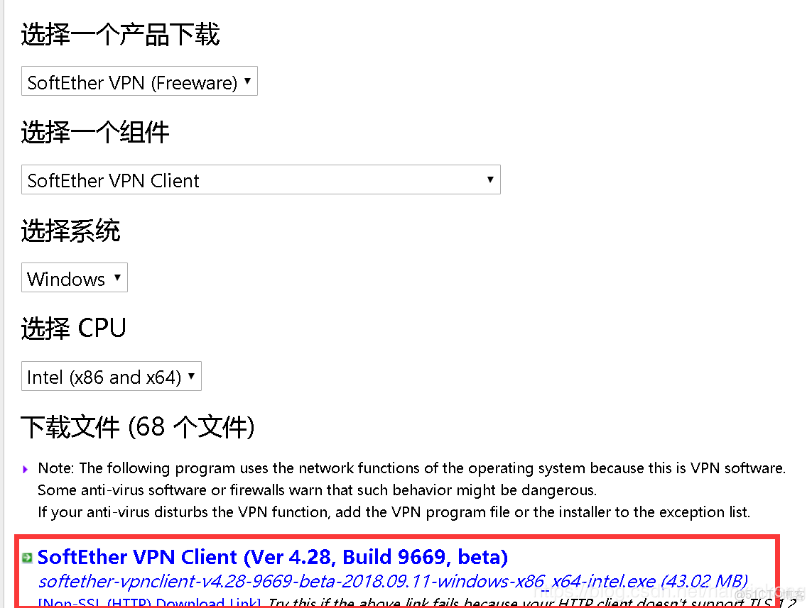

> 安装完成后打开

> 填入服务端 的配置

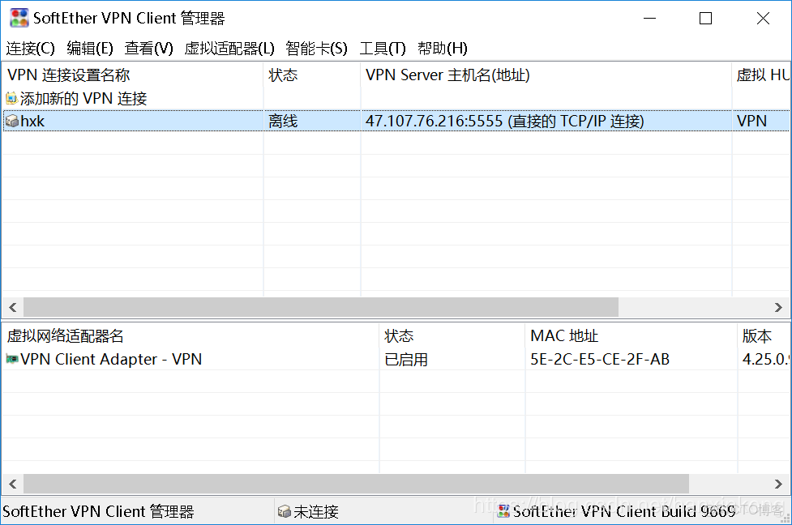

> 双击 连接

> linux 客户端的使用

---

> 安装客户端

`https://www.softether-download.com/cn.aspx?product=softether`

> 进入用户目录

cd /usr/local/

---

> 传入远程主机

rz
--

> 解压安装包

`tar zxvf softether-***client-v4.28-9669-beta-2018.09.11-linux-x64-64bit.tar.gz`

> 进入目录

cd ***client

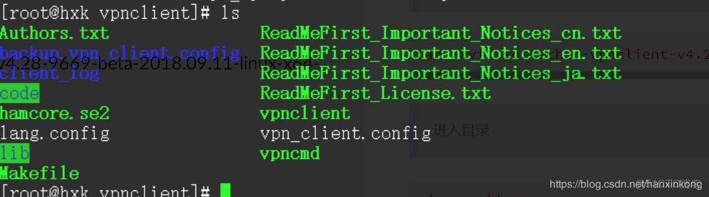

> 安装依赖包 gcc， 编译安装

#yum# install -y gcc

#make#

全部选 1

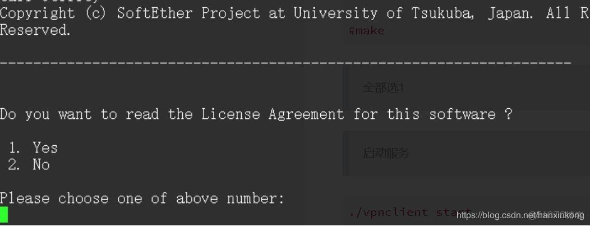

> 启动服务

./***client start

配置客户端

---

`# ./***cmd`

> 选择 2

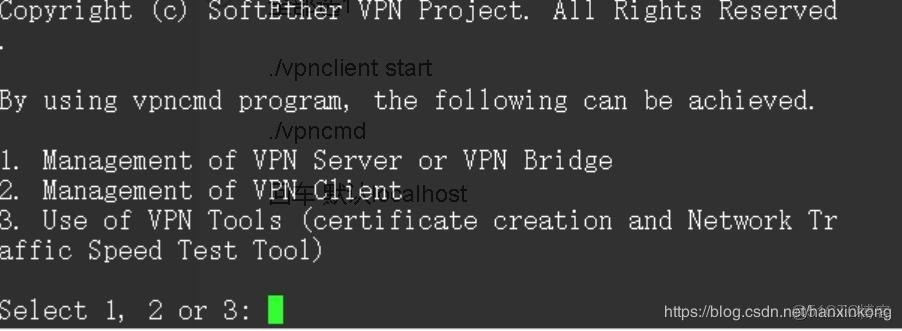

> 回车 默认 localhost

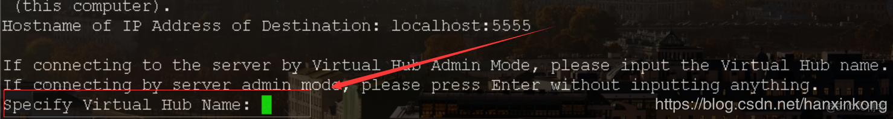

> 允许客户端管理

#RemoteEnable# 1 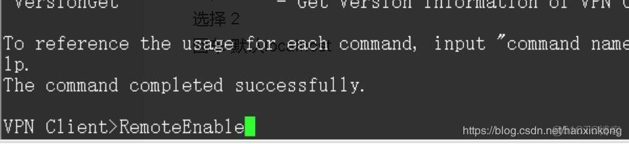

> 退出配置，回到控制台

#exit#

> 设置路由 ip route add 远程服务器 ip via 本地默认网关 dev eth0

> 删除默认路由

ip route del default
1

> 添加路由

ip route add default via 远程服务器网关

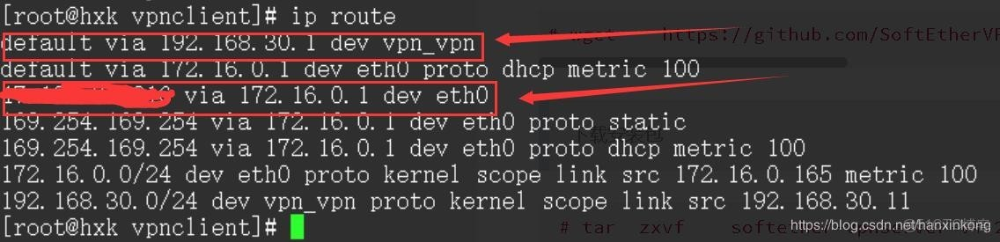

> 检测连接

ping 8.8.8.8 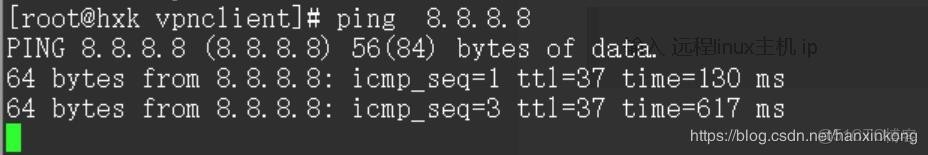

windows 客户管理端

---

> 输入 远程 linux 主机 ip

> 建立连接

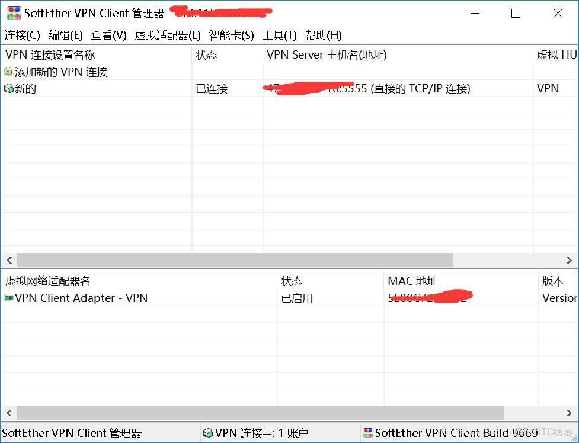

> 双击连接 如果没响应 f5 刷新

> ip 变为远程 *** 服务器 IP

特殊情况

---

> 如果 *** 连接没有 ip

> DHCP 自动获取 ip

#dhclient#

> 此时配置连接完成了
