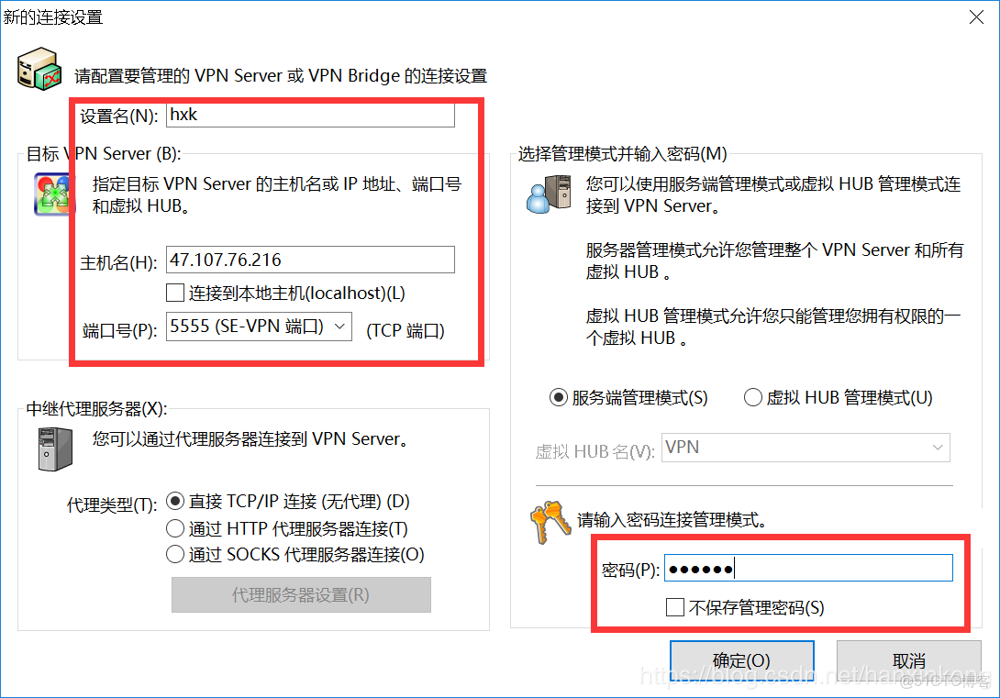
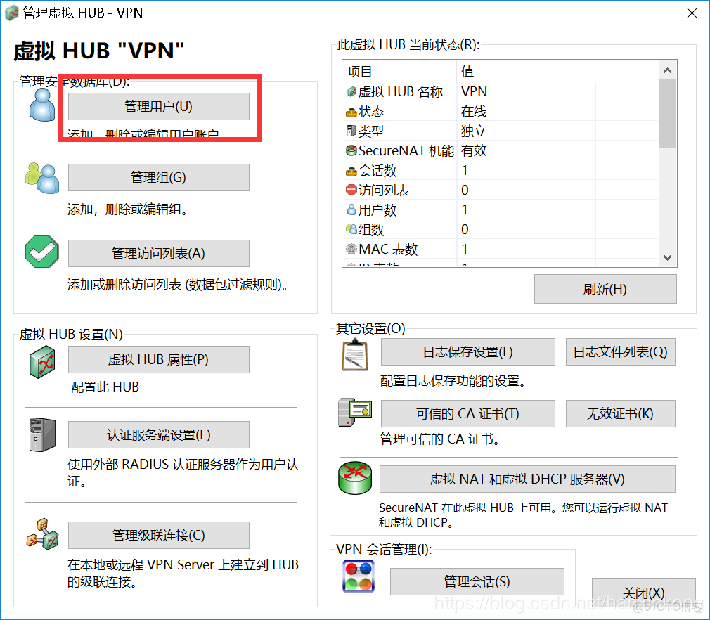
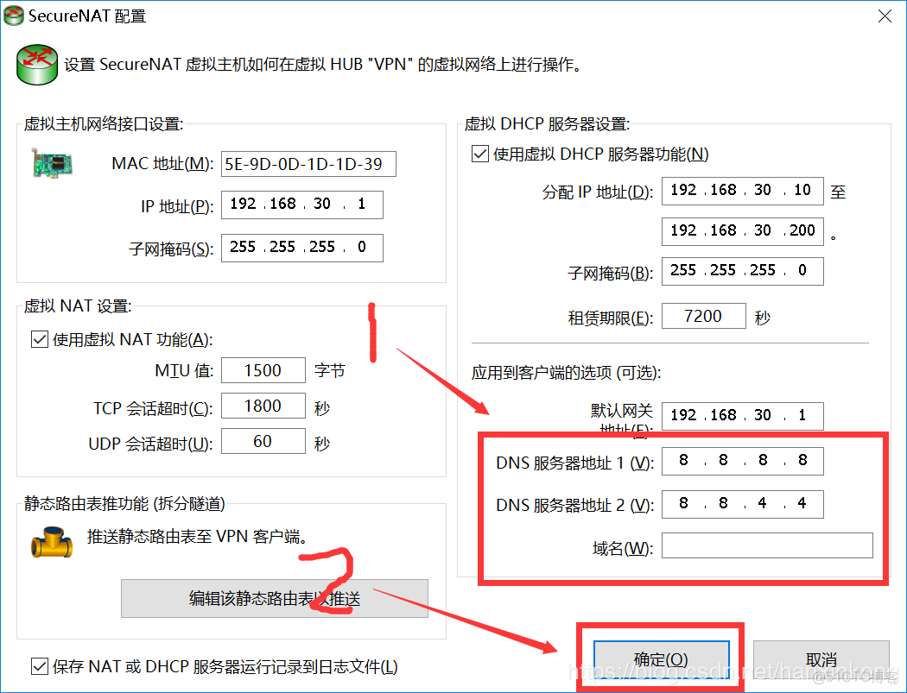
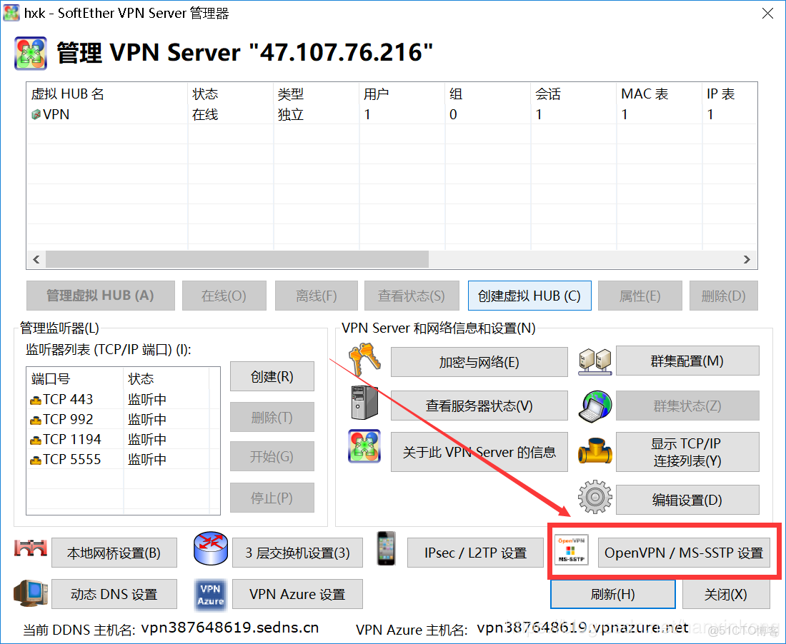

# SoftEther服务器搭建及客户端连接

> 推荐一个主页：https://github.com/hanxinkong

## 下载管理端

> 下载地址 https://www.softether-download.com/cn.aspx?product=softether

## 安装管理端

## 配置管理端

新设置

## 配置参数

以下红框内的参数都很重要。

- 设置名，随便起一个，但是要记住
- 主机名，你的主机地址
- 端口号：你的主机开放的端口
- 密码：用于防止别人乱修改配置

连接即可管理server

## 管理用户

## 添加用户

## 配置NAT和DHCP

生成openvpn配置文件

到此管理端配置好了

# Windows客户端的使用

## 下载客户端

> 下载地址：https://www.softether-download.com/cn.aspx?product=softether

> 安装完成后打开

> 填入服务端 的配置

> 双击 连接

