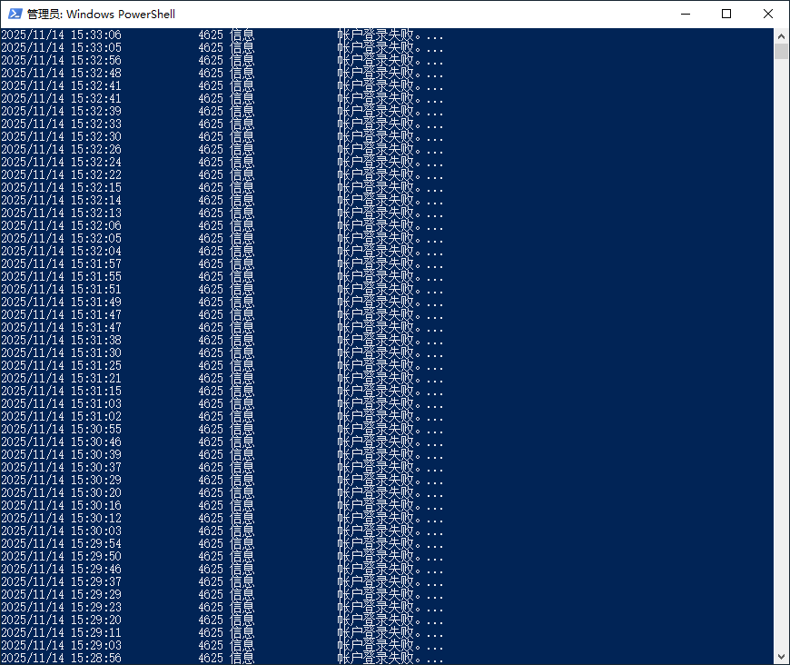
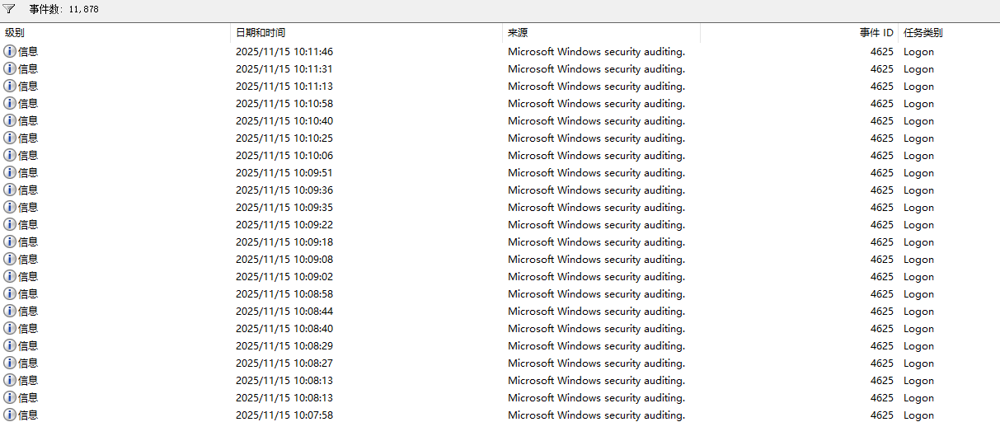
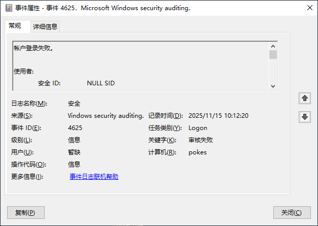

Windows 系统中登录失败记录会保存在安全日志里，可通过系统自带的事件查看器图形化操作查看，也能借助命令行快速查询，具体方法如下：
事件查看器（直观查看，适合普通用户）
按下Win+R组合键打开运行窗口，输入eventvwr.msc并回车，启动事件查看器。
在左侧导航栏中，依次展开 “Windows 日志”，点击子菜单中的 “安全” 选项。

点击右侧操作面板的 “筛选当前日志”，在弹出的窗口中，“事件 ID” 输入框填写4625（该 ID 专门对应账户登录失败事件）；

若为域环境，还可补充4771（Kerberos 登录失败），点击确定。


筛选后会显示所有登录失败记录，双击任意条目，就能查看登录时间、尝试登录的用户名、登录类型及失败原因等详细信息。
命令行 / 终端（快速查询，适合批量导出）

该方式适合需要快速提取记录或批量处理的场景，需以管理员权限操作：

右键点击开始菜单，选择 “Windows 终端（管理员）” 或 “Windows PowerShell（管理员）”。

若要查看所有登录失败记录，输入命令

```bash
Get-WinEvent -LogName Security | Where-Object {$_.Id -eq 4625}
```

查看最近的10条记录：

```bash
Get-WinEvent -LogName Security -FilterXPath "*(System(EventID=4625))" -MaxEvents 10
```

若想将记录导出保存:

```bash
Get-WinEvent -LogName Security | Where-Object {$_.Id -eq 4625} | Export-Csv C:\登录失败记录.csv
```

即可将记录保存为 CSV 文件到 C 盘根目录。


若操作后未查询到日志，可能是未开启登录事件审核功能，可通过gpedit.msc打开本地组策略编辑器，依次进入 “计算机配置→Windows 设置→安全设置→本地策略→审核策略”，双击 “审核登录事件” 勾选 “失败”，再运行gpupdate /force更新策略即可。


今天发现自己电脑有些问题，于是看了一下登录失败的记录，吓我一大跳：

```bash
Get-WinEvent -LogName Security | Where-Object {$_.Id -eq 4625}
```









常规框内我们可以看到内容：

```
帐户登录失败。

使用者:
	安全 ID:		NULL SID
	帐户名:		-
	帐户域:		-
	登录 ID:		0x0

登录类型:			3

登录失败的帐户:
	安全 ID:		NULL SID
	帐户名:		ZF3
	帐户域:		

失败信息:
	失败原因:		未知用户名或密码错误。
	状态:			0xC000006D
	子状态:		0xC0000064

进程信息:
	调用方进程 ID:	0x0
	调用方进程名:	-

网络信息:
	工作站名:	-
	源网络地址:	93.123.109.72
	源端口:		0

详细身份验证信息:
	登录进程:		NtLmSsp 
	身份验证数据包:	NTLM
	传递服务:	-
	数据包名(仅限 NTLM):	-
	密钥长度:		0

登录请求失败时在尝试访问的计算机上生成此事件。

“使用者”字段指明本地系统上请求登录的帐户。这通常是一个服务(例如 Server 服务)或本地进程(例如 Winlogon.exe 或 Services.exe)。

“登录类型”字段指明发生的登录的种类。最常见的类型是 2 (交互式)和 3 (网络)。

“进程信息”字段表明系统上的哪个帐户和进程请求了登录。

“网络信息”字段指明远程登录请求来自哪里。“工作站名”并非总是可用，而且在某些情况下可能会留为空白。

“身份验证信息”字段提供关于此特定登录请求的详细信息。
	-“传递服务”指明哪些直接服务参与了此登录请求。
	-“数据包名”指明在 NTLM 协议之间使用了哪些子协议。
	-“密钥长度”指明生成的会话密钥的长度。如果没有请求会话密钥，则此字段为 0。
```

可以看到源网络地址为：93.123.109.72，在不停的尝试登录，很明确我们被攻击了，有人在试图破解我们的密码，频率是每秒钟尝试一次。


