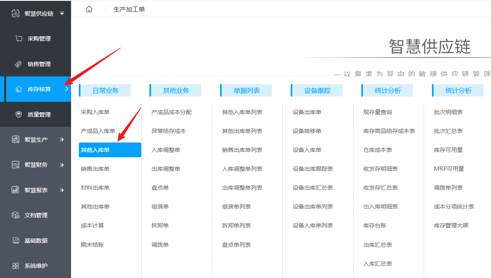
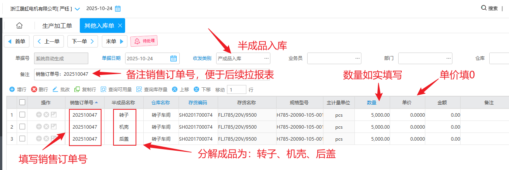
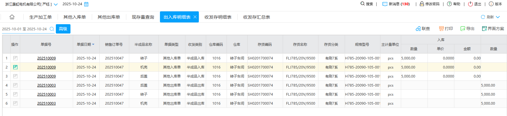

## 一、有刷半成品出入库操作

### 1、将新的订单录入到转子车间

打开《生成加工单》复制新订单信息，以下图为例：

- 浙江凯凯壹工具有限公司
- 销售订单号：202510047
- 产品编码：SH0201700074
- 数量：5000

打开《其他入库单》

填写其他入库单，将生成加工单分解成：转子、机壳、后盖

保存、审核即可！

### 2、转子车间出库

打开《其他出库单》

填写《其他出库单》

## 二、无刷半成品出入库操作

无刷和有刷类似，唯一不同的是：

有刷部分成品，系统内没有物料信息，此时联系管理员创建物料信息即可！操作和上述操作类似

## 三、导出报表

### 出入库明细表

### 其他入库单列表

### 其他出库单列表

### 现存表

库存表，也叫现存表，查询时需要选择仓库，暂时没有数据，无法演示。

