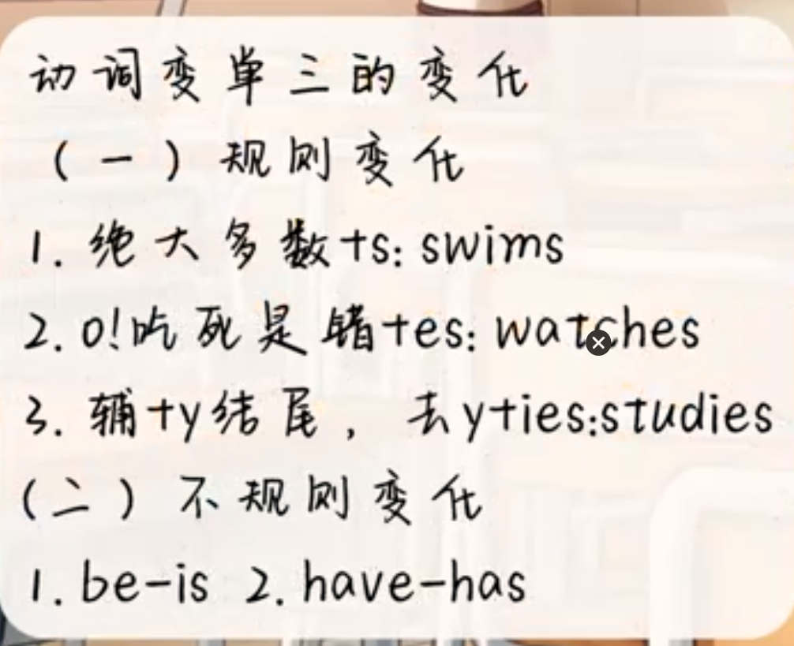

# 英语学习笔记

学习资料：https://www.bilibili.com/video/BV1f34y147DN/?p=3&spm_id_from=pageDriver&vd_source=9dc23d072b0edbf78ffed52f1fcb2318

## 基础部分补漏

### 辅音与元音

辅音：

清辅音10个：[p] [t] [k] [f] [θ] [s] [tr] [ts] [∫] [t∫]，

浊辅音10个：[b] [d] [g] [v] [ð] [z] [dr] [dz] [ʒ] [dʒ]，

其他辅音8个：[h] [m ] [n] [ŋ] [l] [r] [w] [j]。

> 发音方法
>
> 1、/i:/ 舌抵下齿，双唇扁平作微笑状，发“一”之长音。 是字母ea、ee、ey、ie、或ei在单词中的发音，此音是长元音，一定注意把音发足。
>
> 2、/ɪ/ 舌抵下齿，双唇扁平分开，牙床近于全舌，发短促之“一”音。 是字母i或y在单词中的发音，发此音要短促而轻快。
>
> 3、/æ/ 双唇扁平，舌前微升，舌尖抵住下龈，牙床开，软腭升起，唇自然开放。 是字母a在闭音节或重读闭音节中的发音。
>
> 4、/e/ 舌近硬腭，舌尖顶下齿，牙床半开半合，作微笑状。 是字母e或ea在单词中的发音。
>
> 5、/з:/ 舌上抬，唇成自然状态，口半开半闭，发“厄”之长音。 是字母er、ir、or或ur在单词中的发音。

元音

英语重5个元音字母分别为:a[ei]、e[i:]、i[ ai]、o[eu]、u[ju:]，元音发音时声带震动、气流通过口腔不受阻碍。【释义】元音字母，或母音字母，是语言里起着发声作用的字母。元音又作“ 母音”，就是这个意思。

### am/is/are的用法

'am'， 'is'， 和 'are' 是英语中最基本的be动词形式，用于构成现在时态的各种句式。

- 'am' 用于第一人称单数（I）
- 'is' 用于第三人称单数（he， she， it）
-  'are' 用于第二人称单数和所有复数形式（you， we， they， 以及任何复数名词）。

造句例句：

例句1：I am a student.（我是一名学生。）
例句2：He is a teacher.（他是一名教师。）
例句3：They are my friends.（他们是我的朋友。）

语法知识延伸：

> be动词除了表示现在的状态，还可以用于构成进行时态（如 'I am studying.'），被动语态（如 'The book is read by him.'），以及助动词形式帮助构成疑问句、否定句等。此外，'am'， 'is'， 'are' 还有一些变化形式，比如过去时态的 'was' 和 'were'，以及现在分词形式的 'being'，它们在不同的语境和时间背景下使用。例如，'I was studying when he called.'（他打电话来时我正在学习。），'They were playing football.'（他们那时正在踢足球。），'Being honest is important.'（诚实很重要。）。

### 代词宾格

在句子中，人称代词有不同的形式，如主格、宾格、所有格等，用于不同的语法功能。例如，“I”是主格形式，用于作主语；“me”是宾格形式，用于作宾语；“my”是所有格形式，用于表示所属关系。

|   人称   | 单复数 | 主格 | 宾格 |
| :------: | :----: | :--: | :--: |
| 第一人称 |  单数  |  I   |  me  |
| 第一人称 |  复数  |  We  |  us  |
| 第二人称 |  单数  | You  | you  |
| 第二人称 |  复数  | You  | you  |
| 第三人称 |  单数  |  He  | him  |
| 第三人称 |  单数  | She  | her  |
| 第三人称 |  单数  |  It  |  it  |
| 第三人称 |  复数  | They | them |

英语中的人称可以分为‌第一人称、‌第二人称和‌第三人称，每种人称又有单数和复数形式。具体来说：

‌第一人称‌包括“I”（我，单数）和“we”（我们，复数）。
‌第二人称‌包括“‌you”（你，单复数同形）。
‌第三人称‌包括“‌he”（他，单数）、“‌she”（她，单数）、“‌it”（它，单数）以及“‌they”（他们，复数）。
此外，第三人称单数形式还包括“‌his”（他的）、“her”（她的）、“‌its”（它的），这些用于表示所有格形式。

###  第三人称单数 

‌第三人称单数‌是指语言中对主语为第三人称且为单数形式的表述方式。

1. 英语中第三人称单数包括：she、he 、it、不可数名词和人名（一个人的）。

2. 第三人称单数是英语中的一种语法，也称“三单”或“单三”。

3. 在一般现在时中，当主语是第三人称单数时，谓语动词要用第三人称单数形式，即常在动词原形后加-s或-es。

动词变化‌：在英语等语言中，‌第三人称单数动词会有特定形式，‌如加“-s”或“-es”。如“runs”、‌“goes”。如“be”动词变为“is”，“have”变为“has”。

规律：https://haokan.baidu.com/v?pd=wisenatural&vid=3271671317077351842

举例：

他每天早上都跑步去上班。He ==runs== to work every morning.
她喜欢在音乐会上弹钢琴。She ==lives== playing the piano at concert.
它（小狗）总是跟在我后面跑。 It always ==follows== me. (always:总是，follow跟着）
这个人经常来图书馆借书。 This person often ==comes== to the library to borrow books

那只猫喜欢在阳台上晒太阳。The cat likes to sunbathe on the balcony.

‌核心答案‌：‌
The cat likes to sunbathe on the balcony.
‌翻译解析‌：‌

-‌主语确定‌：‌

“那只猫”作为主语，‌翻译为“The cat”。‌

“喜欢”作为谓语，‌翻译为“likes”。‌

“晒太阳”作为动作描述‌，‌翻译为“to sunbathe”。‌

“在阳台上”作为地点状语，‌翻译为“on the balcony”。‌
‌完整翻译‌：‌
将以上各部分组合，‌得到完整的翻译：‌“The cat likes to sunbathe on the balcony.”

他喜欢吃苹果，而她更喜欢香蕉。

翻译如下‌：‌

He likes apples, while she prefers bananas.
‌解析‌：‌

-‌主句结构‌：‌原句由两部分组成，‌分别描述“他”和“她”的喜好，‌翻译时应保持这种并列结构，‌用并列句来表达。‌
-‌词汇选择‌：‌

“喜欢吃”翻译为“likes”，‌表示一种喜好。‌
“更喜欢”翻译为“prefers”，‌表示在两者之间的偏好。‌
-‌连词使用‌：‌使用“while”作为并列连词，‌连接两个句子，‌表示对比关系，‌即两者喜好的不同。‌
-‌保持语序‌：‌英语中，‌通常将主语放在句首，‌谓语放在主语之后，‌宾语放在谓语之后，‌与原句的语序一致，‌因此翻译时保持了原句的语序。‌

这本书的作者是位著名的作家，‌他写了很多畅销书
我的哥哥给我讲故事。 > My brother ==tells== me stories

### 动词不定式

动词不定式是非谓语动词的一种形式，‌具有动词的特性，‌同时也可充当句子中的不同成分，‌如主语、‌宾语、‌定语等。

基本构成‌：由“to+动词原形”构成，‌其中“to”为不定式符号，‌表示动作或状态。

功能与应用‌：

- ‌目的状语‌：表示动作的目的或原因。

- ‌宾语‌：常用于某些动词、‌形容词或介词后，‌表示具体的行为或状态。

- ‌定语‌：修饰名词，‌表示名词的性质或特征。

- ‌补语‌：补充说明主语或宾语的状态或特征。

  

  注意事项‌：在某些情况下，‌动词不定式可省略“to”，‌如在情态动词或助动词后。

举例：

-  I went to the store‌ to buy some milk.（我去商店买牛奶。）  表示动作目的 ,作目的状语
- She decided‌ to study‌ abroad.（她决定出国留学。）跟随特定动词作宾语
- I plan‌ to visit‌ my parents this weekend.（我打算这个周末去看望父母。）跟随特定动词作宾语
- I have a book‌ to read‌.（我有一本书要读。）修饰名词作定语
- He found a place‌ to live‌.（他找到了一个住的地方。）修饰名词作定语
- I consider him‌ to be‌ a genius.（我认为他是个天才。）补充说明‌
- I consider him‌ to be‌ a good friend.（我认为他是我的好朋友。）

## 1.主谓宾句型

### 如何判断主谓宾句型

主语+谓语（动作/动词）+宾语（动作的承受者）

动作

- 身体：看，跑，吃，喝等
- 心里：想，爱，思念，决定等

举例：翻译主谓宾句型，红色为谓语

- 我==爱==你   I love you
- 他==爱==你	He loves you
- 你==吃==米饭	you eat rice
- 这个人==吃==面条  this person eat  noodles
- 我==跑==步	I run 
- 他们==跑==步 	they run
- ##### 她==跑==步	she runs

### 谓语动词变形原则

主谓一致‌：在英语中，主语和谓语在人称和数量上必须保持一致。

- 如果主语是单数，那么谓语（动词）也应该是单数形式（通常是加 "s" 或 "es" 的第三人称单数形式）；

- 如果主语是复数，那么谓语应该是复数形式（通常是动词原形）

核心就是保持："主谓一致‌"

- 当主语是他/她/它，谓语动词需要变形后面加s，==他们除外==，（他们==跑==步 they run）
- 主语数量为1，谓语动词需要变形后面加s，==我和你除外==（这个人==吃==面条  this person eat  noodles（动词加s））

| 主语                              | 谓语动词                    |
| --------------------------------- | --------------------------- |
| 我                                | 不变                        |
| 你                                | 不变                        |
| ==他/她/它== | ==变== |
| ==数量为1==  | ==变== |
| 数量>1                            | 不变                        |

#### 主语是他/她/它

- 他==爱==你	He loves you（动词加s）
- 她==跑==步	she runs（动词加s）
- 他们==跑==步 	they run  (他们除外不加s)

#### 主语数量为

> - 我的妈妈吃饭  my mom eats rice（动词加s）
> - Tom吃米饭  Tom eats rice（动词加s）
> - 我==爱==你   I love you	 (我，除外不加s)
> - 你==吃==米饭	you eat rice	(你，除外不加s)
>

### 宾语存在动词需要变形

- 宾语动词已经做过了：动词+ing
- 宾语动词还没做过：to+动词

> 举例说明：
>
> - 我爱==吃==面条  I love eating noodles  (以前吃过，+ing)
> - 他爱==吃==面条    He love eating noodles  (以前吃过，+ing)
> - 你喜欢==吃==米饭	You like eating rice  (以前吃过，+ing)
> - 这个人喜欢==睡觉==	 this  like sleeping  (以前睡过，+ing)
> - 我想==离开==这里	I want to leave here  （还没有离开，前面加to）
> - 他们决定==乘坐==大巴	They decide to take a bus  （还没有乘坐，前面加to）
> - 她拒绝帮助你	She refuse to help you  （还没有帮助，前面加to）
>

## 2.主系表

如何判断主系表？

判断方式：是，很，在

|       主语        | 系动词 |
| :---------------: | :----: |
|        我         |   am   |
|        你         |  are   |
|   他 \ 她 \ 它    |   is   |
|  数量为 1 的东西  |   is   |
| 数量大于 1 的东西 |  are   |

该表格展示了英语中**be 动词（系动词）的人称 / 数的匹配规则**：

1. 第一人称单数 “我” 对应`am`；
2. 第二人称 “你” 及复数主语（包括数量 > 1 的事物）对应`are`；
3. 第三人称单数（他 / 她 / 它、数量为 1 的事物）对应`is`。

> 举例：
>
> - 这是我的妈妈   This is my mom	"是"是系动词，"是"前面的是主语，"是"后面的是表语
> - 她是中国人    She is Chinese
> - 我很累     I am tired
> - 我在家     I am at home
> - 她在路上   She is on the way
> - 这很有趣    this is funny
> - 它很可爱    It is cute
> - 英语和数学很简单   English and Math are easy
>

## 3.there be句型

判断方式：表达"某个地方有……"

举例：

- 桌上有一台红色的电脑     there be a red computer on the table
- 车上有很多人     there be many people on the bus
- 这里有一些书	there be  some books  here
- 那里有一个女孩   there be a girl there
- 床上有一只小狗   there be a puppy on the bed

**用there be句型翻译句子**

有什么，什么数量=1 there is，数量>1则there are

- 桌上有一台红色的电脑     there is a red computer on the table
- 车上有很多人     there are many people on the bus
- 这里有一些书	there are  some books  here
- 那里有一个女孩   there is a girl there
- 床上有一只小狗   there is a puppy on the bed

## 4.否定句

表达“不”，“否”，“没有”等否定意思

### 主谓宾否定句

规则：主语后+don't/doesn't，==他/她/它或主语的数量为1时==doesn't

- 我爱你    I love you >I don't love you
- 他说英语   He speak English  >  He doesn't  speak English
- 我知道   I know >I don't know
- 他们想离开你   They want leave you>They don't want to leave you

### 主系表否定句

主系表结构：是/很/在

规则：==系动词后+not==

- 我是你的哥哥     I am your brother > I am not your brother
- 他很帅  He is handsome > He is not handsome
- 你很无聊  You are boring > You are not boring
- 这件事情很重要  This is important > This is not important 
- 他们在那里    they are  there > they are not  there

### there be句型否定句

规则：==There is no没有==

- 这里没有人     there is no people here
- 杯子里面没有水     there is no water in the cup
- 抽屉里没有钱     there is no money in the drwer
- 床上没有小狗   there is no a puppy on the bed

## 5.疑问句

疑问句分类：

- 直接回答
- 具体回答

英语疑问词

疑问词用于提问的词或词组，引导疑问句寻求特定信息。

主要类型‌：

- 询问事务what，‌which。例：What is this? 这是什么？‌）
- 询问人‌：who，‌whom。例：Who is that man? （那个男人是谁？‌）
- 询问地点‌：where。例：Where are you from? （你来自哪里？‌）
- 询问时间‌：when，‌what time。例：When did you arrive? （你什么时候到达的？‌）
- 询问方式‌：how。例：How did you do it? （你是怎么做到的？‌）
- 询问原因‌：why。例：Why did you leave? （你为什么离开？‌）

### 主谓宾结构直接疑问句

规则：do/does放句首（主谓宾：主语后动作动词）当==他/她/它或主语的数量为1时==用does，这个和否定句是一样的

- 你爱我吗？   > you love me.     > do you love me?
- 你说英语吗？  > you speak English.    >   do you speak English?
- 你知道吗？  > you know.    > do you know？
- 你的小狗喝羊奶吗？  >  you puppy ==drinks== goat milk.  > Does your puppy ==drink== goat milk?     （肯定句中==drinks==为什么加s, 因为主语 "You puppy" 是单数，因此动词 "drink" 需要变成第三人称单数形式 "drinks" 来保持主谓一致。 ）
- 他想离开你吗？  >  He wants to leave you.  >  Does he want to leave you？ 

==注意：当使用does时，动词无需再加s，因为does是do的复制==

### 主谓宾句型的详细疑问句

规则：==疑问词+do/does==（主谓宾：主语后动作动词）

- 你爱谁？ -> who do you love？
- 你去哪里？ -> where do you go？
- 你知道什么？ -> what do you know？
- 你为什么喜欢这个男孩？ -> why do you like the boy？
- 她如何学英语？ -> how does she learns English?   >>> how does she learn English?  ==当有does时learns去掉s==

### 主系表结构直接疑问句

回答：直接回答，yes/no

规则：==系动词提前==   

- 它是你的小狗吗？->It is your puppy  >  Is it your puppy ?
- 他很帅吗？ ->    He is handsome  >   Is he handsome?
- 这很有趣吗？    This is interesting  > Is this interesting
- 英语很重要吗？ English is important >Is English important?
- 他们在那里吗？ They are there > Are they there?

### 主系表结构详细疑问句

规则：==疑问词+系动词== 

- 你是谁？ -> Who are you ?
- 你的生日是什么时候？->When is your birthday ?
- 你的名字是什么？ ->What is your name ?
- 他们在哪里？ ->Where are they
- 哪个是正确的？->Which is right?

### there be句型的直接疑问句

规则： ==以is there开头==

- 这里有一些人吗？ -> Is there anybody？
- 杯子里面有一些水吗？ -> Is there any water the bottle?
- 附近有一个音乐吧吗？ -> Is there a live house nearby？

### there be句型的详细疑问句

规则： ==how many... + are there + 地点==

- 大厅里有多少人？ -> how many people + are there + in the hall ?
- 教室里有多少男孩？ -> how many boys + are there + in the classroom?
- 盒子里有多少球？ -> how many balls + are there + in the box?